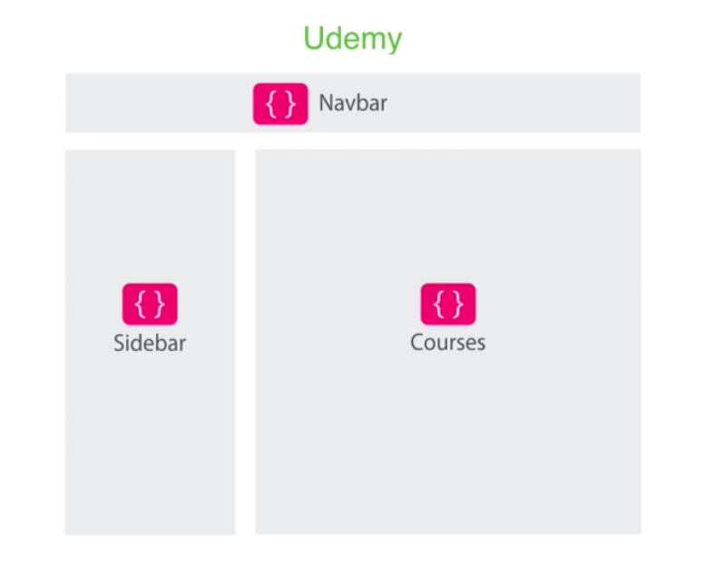
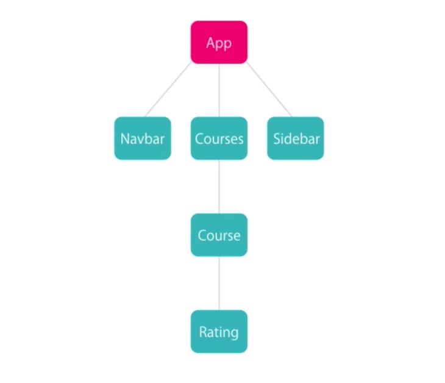
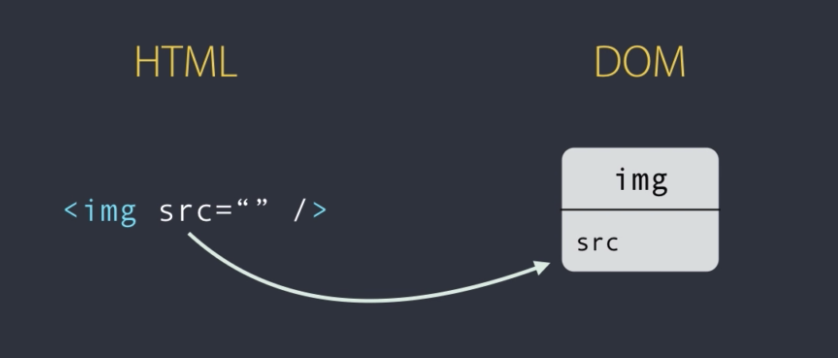
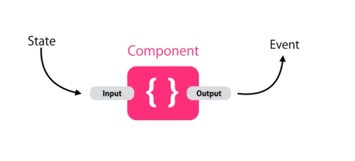
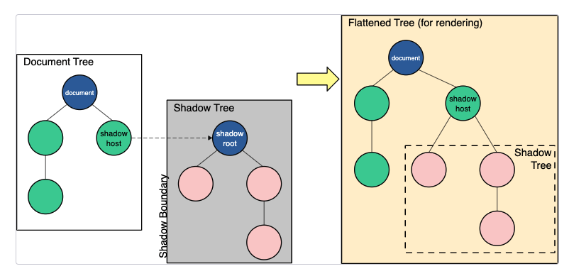
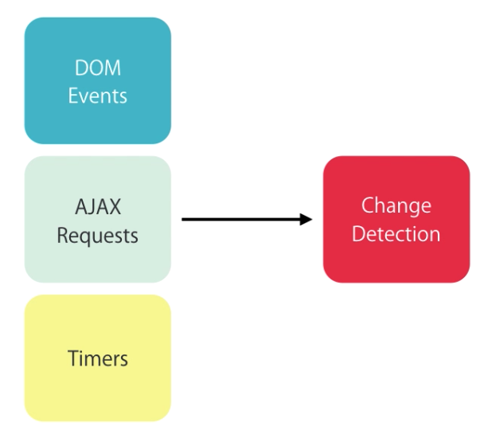

# Angular

<br>

## Resources
* https://www.udemy.com/course/the-complete-angular-master-class/learn/lecture/7251988#learning-tools
* https://www.typescriptlang.org/docs/handbook/
* https://developer.mozilla.org/en-US/docs/Web/JavaScript/Reference/Operators/Conditional_Operator
* [YouTube: Fullstack Angular Spring Kubernetes App](https://www.youtube.com/watch?v=aPzpsfQtlKY)
* https://www.baeldung.com/spring-cloud-angular
    * connect to Spring (Eureka?)
* https://angular.io/guide/template-reference-variables
* https://developer.mozilla.org/en-US/docs/Web/Web_Components/Using_shadow_DOM
* https://stackoverflow.com/questions/38469396/should-angular2-inputs-be-public-or-can-should-we-have-a-stricter-api-by-making
* https://stackabuse.com/npm-install-specific-version-of-a-package/
* https://stackoverflow.com/questions/43034758/what-is-the-difference-between-ngif-and-hidden

<br>

## Overview
* Angular is a framework for building frontend applications using HTML, CSS, JS / TypeScript.
* We use JS-frameworks, like Angular and React, because they make our lives easier: provides reusable utility code, easier to test and allows us to build more complex applications.
* As much as possible, business logic should be encapsulated in the backend - the frontend angular app should just focus on the presentation logic. 
* Node JS is required to run an Angular app - Node JS is a runtime environment for executing JavaScript outside of the browser (server-side JS).
* Angular provides a CLI that is used to create projects, generate boilerplate code and build your packages for deployment.
    * install CLI: 
        * ```npm i -g @angular/cli```
    * new project:
        * ```ng new <PROJECT-NAME>```
    * run app locally (default localhost:4200)
        * ```ng serve```
* Angular comes with a build automation tool, called ```Webpack``` - it allows us to make changes to our code and see these changes takes effect in the browser, without manually stoping and starting the server - Webpack automatically recompiles for you.
    * This feature is called Hot Module Reloading / Replacement
    * Webpack is a tool for creating bundles for our stylesheets & scripts and injecting them into our app at runtime.
* Angular Version History
    * Angular JS - 2010, written in JS, going to die sooner or later
    * Angular 2 - 2016, completely rewritten - using TypeScript
    * Angular 4 - technically Angular 2.4 but the version naming convention was changed
        * Then the developers dropped the version number - now we just have "Angular"
* In VS Code, it is very useful to use the ```Auto-Import``` plugin for TypeScript.
* Generate some HTML quickly (Zen Coding, Emmet)
    * example:
        * ```div.panel.panel-default>div.panel-heading+div.panel-body``` + ```'tab```
            * gives:
                ```html
                    <div class="panel panel-default">
                        <div class="panel-heading"></div>
                        <div class="panel-body"></div>
                    </div>
                ```
* Using double vs single quotes (```" "``` vs ```' '```)
    * Stack Overflow [debate](https://stackoverflow.com/questions/242813/when-should-i-use-double-or-single-quotes-in-javascript)
    * My preference:
        * use single (```' '```) for javascript
        * use double (```" "```) for HTML
    * Don't worry about it too much, be flexible but maintain consistency as much as possible.

<br>

## Angular Project Structure
* Like the ```main``` method in Java, we have a ```src/main.ts``` file that acts as the starting point of our application
* ```polyfills.ts``` imports extra scripts into the app that make up for the fact that most browsers do not support all of the JS features required to run Angular
* Every Node JS project has a ```package.json``` file, like the POM in Java, it specifies the depenedencies required by our application.
* ```protractor.conf.js``` and ```karma.conf.js``` are files that enable us to run tests.
* Inside ```index.html``` we don't have references to style sheets or script modules; instead, Webpack is responsbile for injecting these at runtime - this is what allows for Hot Module Reloading.
    * Scripts and Stylesheet are grouped together as JavaScript ```bundle```'s.

<br>

## TypeScript
* TypeScript is a wrapper around JavaScript that offers additional features that are not supported by the vanilla JavaScript that you can run in the browser. 
    * This includes:
        * Strong / Static Typing - optional, easier to read code and debug
        * OOP features - classes, constructors, interfaces, access modifiers, generics
        * Catch errors at compile time - not just at runtime
        * Access to additional tools (great support)
* TypeScript is a superset of JavaScript - all JS is valid TypeScript.
* Browsers cannot understand TypeScript; when we compile our application, we 'transpile' TypeScript into JavaScript so that the browser can interpret it.
* Install: ```npm i -g typescript```
* Compile (TypeScript -> JS): ```tsc main.ts```
    * When we run ```ng serve```, ```tsc``` (TypeScript Compile) is called automatically.
        * use ```--target ES5``` to compile to JS ES5, etc
* Run: ```node main.js```
* Variable Declarations:
    * ```let```
        * a variable declared with ```let``` is scoped to the nearest code block. 
    * ```var```
        * a variable declared with ```var``` is scoped to the nearest function.
    * We should use ```let``` whenever possible.
        * JS ES5 is supported by all browsers; ```let``` was introduced in JS ES6 (2015).
        * When we run ```tsc main-varDec.ts``` and encounter compile time errors as a result of using ```let```, the compiler with flag the error but still transpile the TypeScript to JS and replace the declaration with ```var```.
* Types
    * In JS, variables are weakly/dynamically typed; TypeScipt enforces strong typing but will permit weak typing at compilation because JS allows it
        * example:
            * ```let count = 5; count = 'a';``` 
                * JS won't complain about this
                * TypeScript will complain that ```count``` is of type ```number```
    * In TypeScript, when we declare a variable but do not initialise it, the type is set to ```any```.
        * As a result, it seems we can change the type on the fly because 'any' permits any type.
        * example:
            * ```let condition; condition = true; condition = 0; ```
            * TypeScript doesn't mind that we changed the type as ```condition``` is of type ```any```
    * When we don't know the value of a variable ahead of time, we should use Type Annotations
        * ```let a: number;```
        * ```let b: boolean;```
        * ```let c: string;```
        * ```let d: any;```
        * ```let e: number[];```
        * ```let f: any[] = [1, true, 'a', 0.99];```
    * Enum
        * a useful way of storing a group of related constants
        * example:
            * define: ```enum Color {Red, Green, Blue}```
            * access: ```let backgroundColor = Color.Green```
            * a better way to define:
                * ```enum Color { Red = 0, Green = 1, Blue = 2};```
                * using indexed values is better as it can prevent code breaking if the order of elements in the enum changes in the future (enum values are assigned an index automatically but manually doing improves readability)
    * Type Assertions
        * example:
            * ```let str1 = 'abc'; let endsWithC = str1.endsWith('c'); ```
                * TypeScript is comfortable that ```str1``` is a ```string```; so it suggests string methods that we can call (```.endsWith()```)
            * ```let any1; any1 = 'abc'; let endsWithD = str1.endsWith('d'); // no string method suggestion ```
                * We can use Type Assertions to enforce ```any1``` as a ```string``` when we want to access type methods
                    * method 1: ``` let endsWithE = (<string> message).endsWith('e'); ```
                    * method 2: ``` let alternativeEndsWithE = (message as string).endsWith('e'); ```
* Arrow Functions 
    * Arrow Functions give us a clean way to define functions
    * example
        * ``` let log = function(message) { console.log(message);} // standard JS ```
        * ``` let doLog = (message) => { console.log(message);} // using TypeScript ```
* Classes & Interfaces
    * Classes allow us to group togther variables (propeties) and functions (methods) that are highly related.
        * Constructors - we cannot have multiple constructors, like we do in Java-land; instead we get round this by having optional parameters (```?```).
            * Once you have declared a parameter as optional (```?```), all other following parameters in the method signature must also be optional.
                * ```a required parameter cannot follow an optional parameter```
    * Interfaces are similar to Classes but they can only be used to declare the fields and methods - they cannot be used to define the implementation
        * example:
            * see ```./ts-hello/main-interfaces.ts```
* Access Modifiers
    * ```public```
        * the default setting, ```public``` means that our variable in accessible from anywhere in our program - we should avoid this where possible to get the benefits of encapsulation. 
    * ```protected```
    * ```private```
        * restricts the variable scope to within the class itself - access to a field is then done through public getters and setters (and constructor).
    * We can use access modifiers in the constructor in order to define them in a shorthand form.
        * example:
            * ``` class Coordinate { constructor(private x?: number, private y?: number) {} } ```
                * here we avoid declaring our fields at the top of the class and also the typical way of initialising them in the constructor (```this.x = x```) - TypeScript does this for you. 
            * ```constructor(public x?: number, public y?: number) {} ```
                * In order to get this shortcut from TypeScript, we must explicitly specify the access modifier - therefore, we need to use ```public``` in this instance.
* Properties
    * Properties are features of a class that give us getter and setter methods, that behave like fields - it gives us cleaner syntax for enabling encapsulation: we can make access to our fields read-only or we can add validation for setting them.
        * TLDR: a Property looks like a field from the outside but is really a method within the class.
        * example:
            * ``` get y() { return this._y; } ```
                * a getter method that behaves as a field: ``` console.log(coord.x) ```
            * ``` set y(value) { this._y = value; } } ```
                * a setter method that behaves as a field: ``` coord.x = 1 ```
            * ```constructor(private _x?: number, private _y?: number) {}``` 
                * ```_varName``` is used in the constructor to free up ```varName``` for use in the Property
* Modules
    * TypeScript modules are segments of code that we import into another file
    * example:
        * see ```./ts-hello/main-modules.ts```
* Facebook Example Exercise:
    * see ```./ts-hello/exercise-facebook.ts``` for my initial solution
    * see ```./ts-hello/exercise-facebook-soln.ts``` for Mosh's better solution
* String Formatting
    * ```console.log(`likesCount: ${likeButton.likesCount}, isSelected: ${likeButton.isSelected}`)```
        * ensure that you use backticks instead of ```'' or ""```
* Ternary Operator
    * ``` condition ? exprIfTrue : exprIfFalse ```

<br>

## Angular Fundamentals
* Angular Building Blocks
    * An Angular app is comprised of one or more components
    * Components
        * A Component in Angular encapulates the data, HTML and logic for a view (an area of the screen that the user sees)
            * example: taking the Udemy website as an example, we could logically group the various sections of the screen into different Angular components - such as the sidebar, navbar, etc (these can be reused across the different pages of our website, or even different apps).

            <br>
            
            
            <br>

        * Every Angular app has a root ```App``` component (```<app-root>```). The rest of the app is a tree of components that branches from this.

            <br>
            
            
            <br>
    * Modules
        * An Angular Module is a group of related components; every app has at least once module called ```AppModule```.
            * As the application grows, you may with to break this module down into smaller modules.
                * In our Udemy website example, we may wish to have a ```Courses``` module which handles all of the course-related components - Courses, Course, Rating, etc.
* Components
    * A Component is a group of related data, HTML and logic for a view (a section of the page that the user sees).
    * There are three steps to use a Component:
        1. Create the Component
            * when naming our component file we use ```<COMPONENT_NAME>.component.ts```
                * example:
                    * ```courses.component.ts``` for a 'Courses Component`
                    * ```course-form.component.ts``` for a 'Course Form` Component, separate words with hypen (```-```)
            * creating the actual component
                * example
                ```javascript
                import { Component } from '@angular/core';
                
                @Component({
                    selector: 'courses', 
                    template: '<h2>Courses</h2>'
                })
                export class CoursesComponent{

                }
                ```
                * Component selector options:
                    * ```selector: 'courses'```: renders ```<courses>```
                        * CSS selection: ```courses {}```
                    * ```selector: '.courses'```: renders ```<div class='courses'>```
                        * CSS selection: ```.courses {}```
                    * ```selector: '#courses'```: renders ```<div id='courses'>```
                        * CSS selection: ```#courses {}```
        2. Register it in a module
            * to register ```CoursesComponent``` in our ```App``` module, we open ```app.module.ts``` and add it as a declaration within ```@NgModule```
                ```javascript
                import { CoursesComponent } from './courses.component';
                ...

                @NgModule({
                declarations: [
                    AppComponent, CoursesComponent
                ],
                ...
                })
                export class AppModule { }
                ```
        3. Add an element in the HTML markup
            * In ```src/index.html``` we have a custom element called ```<app-root>``` - this comes from ```src/app/app.component.ts```. This tag will render the HTML inside ```src/app/app.component.html``` on ```src/index.html```. Therefore to add our ```CoursesComponent``` HTML to the index page, all we have to do is add ```<courses>``` to ```src/app/app.component.html```.
    * It is better practise to use the ```ng``` cli to generate and register components for you.
        * ```ng generate component <COMPONENT_NAME>```
            * shorthand: ```ng g c <COMPONENT_NAME>```
        * note:
            ```clt-` ``` (on Mac) toggles the VS Code terminal
* Templating
    * We can dynamically insert data into our HTML using ``` {{ }} ``` notation (String Interpolation).
        * example:
        ```javascript
        @Component({
            selector: 'app-courses',
            template: '<h2>{{title}}</h2>'
        })
        export class CoursesComponent{
            private _title = "List of Courses";

            get title() {
                return this._title;
            }

        }
        ```
        * this will insert ```List of Courses``` into our DOM.
* Directives
    * Directives are used to manipulate the DOM - we can add/remove elements, change an element's class, etc.
* Services
    * Components should only be responsible for the presentation logic and not for retrieving data from HTTP endpoints -  this responsibility is delegated to a Service class. This is so we do not tightly couple our Component to the HTTP endpoint - promoting reusability of the HTTP endpoint across the app, improving readability of the code and testability when it comes to unit testing the Component (simplicity).
        * example:
            * following on with our ```CoursesComponent``` example, we can add a ```CoursesService``` inside ```src/app/courses/courses.service.ts```
    * Dependency Injection
        * Angular has a dependency injection framework that injects dependencies into our classes at runtime. This decouples the implementation of a dependency from where it is being used and therefore improves Object Oriented design.
            * example: 
                * Our ```CoursesComponent``` is dependent on the ```CoursesService``` but instead of simply instantiating the ```CoursesService``` in our ```CoursesComponent``` constructor, we ask Angular to inject this dependency for us - providing that we register this dependency in our module.
                    * Step 1: Create ```CoursesService```
                    ```javascript
                    // No Decorator, unlike @Component
                    // We would use @Injectable if this class had its own dependencies 
                        // @Component includes @Injectable
                    export class CoursesService {

                        getCourses() {
                            // consume HTTP endpoint...
                            return ["course1", "course2", "course3"];
                        }
                    }
                    ```
                    * Step 2: Add it as a dependency in ```CoursesComponent```
                    ```javascript
                    constructor(service: CoursesService) {
                        this._courses = service.getCourses();
                    }
                    ```
                    * Step 3: Register ```CoursesService``` in ```AppModule```
                    ```javascript
                    @NgModule({
                    declarations: [
                    ...
                    ],
                    imports: [
                        ...
                    ],
                    providers: [CoursesService],
                    bootstrap: [...]
                    })
                    export class AppModule { }
                    ```
                    * alternatively you can specify the registration in the Service class:
                        ```javascript
                        @Injectable({
                            providedIn: 'root'
                        })
                        export class CoursesService { }
                        ```
    * Using the CLI to generate services
        * ```ng generate service <SERVICE-NAME>``` 
            * example: ```ng g s email```
* Author Example Exercise:
    * see ```./exercise-author/my-soln``` for my initial solution
    * see ```./exercise-author/mosh-soln``` for Mosh's better solution
        * notes:
            * ```authors``` is an array, so we don't need a authorCount field (just use ```authors.length```)
            * generate html list using ```ul>li``` + ```tab```
            * when using the CLI to generate components, the custom HTML tag are of the form ```app-<COMPONENT_NAME>``` - this is to avoid potential clashes with imported 3rd party components.
                * Mosh takes the view that this ```app-``` prefix should be removed most of the time to improve readability.

<br>

## Displaying Data & Handling Events
* Property Binding
    * Property Binding is when we bind a property of our DOM element (ex: ``````) to a field in our component (ex: ```private _imageUrl: string```) - String Interpolation is a syntactical sugar that makes Port Binding easier to read.
    * String Interpolation is converted into Property Binding when we run our templates.
        * String Interpolation: ``` <h2> {{ title }} </h2> ```
            * gets converted into Port Binding: ```<h2 [textContent]="title"></h2>```
                * String Interpolation is less noisy but sometimes using the Property Binding syntax is preferable: `````` vs `````` - Port Binding is nicer here.
    * Port Binding works one way: the DOM elements will change when any changes to the component field are made; however, the reverse is not true - changes to the DOM element are not reflected back to the component field. 
* Attribute Binding
    * The DOM (Document Object Model) is a tree of objects in memory.
    * HTML is the language that our page is written in; we when run our HTML file, the HTML is converted into a DOM.
        * The DOM can also be created programmatically with JS.
    * Most of the HTML element attributes have a 1-1 relationship with properties of DOM objects.

        <br>
        
        
        <br>

        * There are a few exceptions, however - such as the ```colspan``` attribute of ```<td>```, there exists no DOM equivalent. The reverse is also true: there exists a ```textContent``` property as part of ```h1``` in the DOM but there is no such attribute in HTML.
        * It is important to remember that with Property Binding we are binding component fields to a property of the DOM, not attributes of an HTML element.
        * If we want to bind a component field to an attribute that doesn't exist as a DOM property (like ```<td>```'s ```textContent```), we have to use the following syntax:
            * ```javascript
                <table>
                    <tr>
                        <td [attr.colspan]="colspan"> </td>
                    </tr>
                </table>
              ```
                * not simply: ```[colspan]="colspan"```
* Bootstrap:
    * A CSS library that can be used to rapidly create web apps with a modern look and feel
        * https://getbootstrap.com/
    * Install: ```npm i bootstrap --save```
    * Add ```@import "~bootstrap/dist/css/bootstrap.css";``` to ```/src/styles.css```
        * In this file we hold the styles that are globally accessible across our application.  
    * Reference bootstrap in the desired component HTML
        * example: ```<button class="btn btn-primary"></button>```
* Class Binding
    * In certain situations we may wish to add particular classes to an element if certain conditions are met - we use Class Binding for this (a variation of Property Binding).
        * example: we may wish for an element to be ```active``` when clicked on; we can assign it ```class='active'``` and utilise the CSS styling in ```.active {}```.
            * To do this in Angular, we property bind a field (condition) in our component to the template.
                * example: 
                    * in ```courses.component.html```: 
                        * ```javascript
                            <button class="btn btn-primary" [class.active]="isActive"> Save </button>
                          ```
                    * in ```courses.component.ts```:
                        * ```javascript
                            private _isActive: boolean;
                            ...
                            get isActive() {
                                return this._isActive;
                            }
                          ```
                    * When ```isActive``` evaluates to ```true```, the class ```active``` will be applied to the button; when it is ```false``` (not true?) it will be removed.
* Style Binding
    * With Style Binding we an choose to apply particular inline CSS styling to elements based on a condition.
        * full list of properties to configure: 
            * https://www.w3schools.com/jsref/dom_obj_style.asp
    * example:
        * ``` <button class="btn" [style.backgroundColor]="isActive ? 'pink' : 'white'"> Click Me </button> ```
            * ```isActive``` is a public boolean property in our component
* Event Binding
    * Used to handled events from the DOM - such as keystrokes, mouse movements, clicks, etc.
        * DOM Events:
            * https://www.w3schools.com/jsref/dom_obj_event.asp
            * You can add custom events with ```EventEmitter```.
    * We bind a named event to a method in our component.
    * Event Bubbling
        * Events from the DOM will bubble/propagate up the DOM tree.
        * example: a ```<button>``` and ```<div>``` both handle the ```click``` event  but bind them to different methods in the component. If ```<div>``` wraps the ```<button>```, on the ```click``` of the ```<button>```, both elements will trigger their bound methods as the ```<button>``` event bubbles up to the ```<div>``` and beyond.
        * We can prevent Event Bubbling by calling this method in the last method that we want the event to propagate to: ``` $event.stopPropagation(); ```
    * example:
        ```javascript
            export class CoursesComponent{
                ...

                save($event: Event){
                    $event.stopPropagation(); // prevent Event Bubbling
                    console.log('Button was clicked', $event);
                }

                onDivClick($event: Event){
                    console.log('Div was clicked');
                }

            }
        ```
        ```javascript
            // courses.component.html
            <div (click)="onDivClick($event)">
                <button class="btn btn-secondary" (click)="save($event)"> No, Click Me </button>
            </div>

        ```
* Event Filtering
    * This is used in association with the ```(keyup)``` event; this event handler hears every keystroke and then traditionally it was up to the programmer to write custom logic to determine which key was being pressed (ex: ```if($event.keyCode === 13) {console.log("ENTER was pressed);}```). With Event Filtering, Angular will handle this for us:
        * example:
            * old: ``` <input (keyup)="onKeyPressed($event)"> ```
                * determine if keycode is 13 in ```onKeyPressed()``` method
            * new (Event Filtering): ``` <input (keyup.enter)="onEnterPressed()"> ```
* Template Variables
    * With ```<input>``` fields, we can extract the user input using the following:
        * in our component (that has a the method bound to an event):
            * ```$event.target.value```
    * There is a better way to do this in Angular, using Template Variables.
        * ```javascript
            <input #email placeholder="Enter Email" />
            <button (click)="submitEmail(email.value)">Submit Email</button> <!-- you can use template variables across the DOM -->
          ```
        * ```javascript
            submitEmail(email: string){
                console.log(email);
            }
          ```
* Two-Way Binding
    * Two-Way Binding allows us to achieve better object-oriented design by passing objects around from user input, instead of simple parameters (like with Template Variables).
    * To do this, we bind the Property of a DOM object to a field in our component.
        * We use the ```ngModel``` directive (a directive manipulates the DOM) to achieve two-way binding, by binding our component field to this property.
            * We use 'bannana in a box' syntax for this: ``` [(ngModel)] ```
            * To use ```ngModel``` or build any kind of form, we have to import the ```FormsModule``` into ```app.module.ts```.
            ```javascript
                @NgModule({
                declarations: [
                    ...
                ],
                imports: [
                    ...,
                    FormsModule
                ],
                providers: [...],
                bootstrap: [...]
                })
            ```
        * example:
            * ``` <input [(ngModel)]="address" (keyup.enter)="submitAddress()" placeholder="Enter Address & Press Enter" /> ```
* Pipes
    * Pipes are used to format data
        * [Docs](https://angular.io/guide/pipes) on using Pipes.
    * There are a number of inbuilt Pipes:
        * Uppercase (```uppercase```)
        * Lowercase (```lowercase```)
        * Percent
            * formatted in similar way to ```number```
        * Decimal (```number```)
            * Although the class is called ```Decimal```, we refer to it using ```number```.
            * Decimal will add ```,```'s for every 3 digits for digits before the decimal place.
            * We can control the number of digits before the decimal place and afterwards
                * ```number:'numDigitsBefore.minNumDigitsAfter-maxNumDigitsAfter'```
                    * configuring these values will round the values up and down.
                * example: 
                    * ```{{ 4.9747 | number:'1.2-2' }}``` gives ```4.97```
                    * ```{{ 4.9747 | number:'2.1-1' }}``` gives ```05.0```
        * Currency (```currency```)
            * ```{{ 190.95 | currency }}``` defaults to ```USD190.95```
            * We can control the currency type, symbol used and digit formatting (in a similar way to Decimal/```number```).
                * example: 
                    * ```{{ 190.95 | currency:'AUD' }}``` gives ```AUD190.95```
                    * ```{{ 190.95 | currency:'AUD':true:'1.1-1' }}``` gives ```A$191.0```
                        * should ```numDigitsBefore``` be less than the actual/original number of digits before the decimal place, the presented number of digits before the decimal place will be the original amount - i.e ```190.95 | number/currency:'1:1-1'``` is ```191.0``` not ```200.0```.
        * Date (```date```)
            * look at the [DatePipe Docs](https://angular.io/api/common/DatePipes) for formatting options.
    * Pipes can be chained togther to combine their functionality.
    * Example use:
        ```javascript
            // courses.component.ts
            export class CoursesComponent{
                private _dummyCourse = {
                    title: "The Complete Angular Course",
                    rating: 4.9745,
                    students: 301023,
                    price: 14.99,
                    releaseDate: new Date(2016, 3, 1)
                };

                ...

                get dummyCourse() {
                    return this._dummyCourse;
                }
            }

            // courses.component.html
            ...
            <p> {{ dummyCourse.title | uppercase | lowercase }} </p>
            <p> {{ dummyCourse.students | number }} </p>
            <p> {{ dummyCourse.rating | number:'1.2-2' }} </p>
            <p> {{ dummyCourse.price | currency:'GBP':true:'3.2-2' }} </p>
            <p> {{ dummyCourse.releaseDate | date:'longDate' }} </p>
        ```
    * Custom Pipes
        * We can also create our own custom Pipes.
        * An example use for this might be a text (string) field in our component that is really long; perhaps on our view, we only want to display a ```summary``` of this text.
            * Step 1: Create ```/src/app/summary.pipe.ts```
            ```javascript
                @Pipe({
                    name: 'summary'
                })
                export class SummaryPipe implements PipeTransform {
                    transform(value: string, limit?: number) {
                        if(!value)
                            return null;
                        
                        let actualLimit = (limit) ? limit : 50;
                        return value.substring(0, actualLimit) + "...";
                    }
                    
                }
            ```
            * Step 2: Register it in ```src/app/app.module.ts```
            ```javascript
                @NgModule({
                    declarations: [
                        ...,
                        SummaryPipe
                    ],
                    imports: [
                        ...
                    ],
                    providers: [...],
                    bootstrap: [...]
                    })
            ```
            * Step 3: Use it in your component HTML template
            ```javascript
                <p> {{ dummyCourse.description | summary:100 }} </p>
                    // make sure there is a description field in your dummyCourse object
            ```
            * Of course, it is better practise to use the Angular CLI - a lot faster:
                * ```ng g pipe <PIPE_NAME>```
* Favourite Component Exercise
    * see ```./exercise-favourite-component/my-soln``` for my initial solution
    * see ```./exercise-favourite-component/mosh-soln``` for Mosh's better solution
        * notes:
            * I opted to use a ternary operator to toggle between solid and empty stars
                * to this I used the following resources:
                    * ```ngClass```: https://angular.io/api/common/NgClass
                    * [angular tenary operator stack overflow](https://stackoverflow.com/questions/35230541/can-ngclass-use-ternary-operator-in-angular-2)
                * Mosh's solution is slightly more verbose but I would argue is easier to read (nice formatting).
            * Bootstrap removed ```glyphicons``` in later versions, so I had to use a older version (^3.3.7 in ```package.json```)
                * glyphicons: https://getbootstrap.com/docs/3.3/components/#glyphicons-examples
                * I did experiment with font awesome but only solid icons are part of the free plan (regular, outline, icons are part of PRO).
* Title Casing Exercise
    * see ```./exercise-title-casing/my-soln``` for my initial solution
    * see ```./exercise-title-casing/mosh-soln``` for Mosh's better solution
        * notes:
            * Remember to import ```FormsModule``` into ```app.module.ts``` before using ```[(ngModel)]``` to achieve Two-way Binding.
            * see Mosh's soln for a better title-casing algorithm and all round cleaner formatting.

<br>

## Building Reuseable Components
* Property binding doesn't work by default for custom components - you need to define an Input Property to do this.
    * example: this doesn't work by default - ```<favourite [isFavourite]="isFavourite"></favourite>```, despite the fact that ```isFavourite``` is a property of the ```<favourite>``` component.
        * ```Can't bind to 'isFavourite' since it isn't a known property of 'favorite'```
    * Property Binding Syntax Reminder:
        * ``` <DOM_OBJECT [DOM_PROPERTY]="COMPONENT_PROPERTY"></DOM_OBJECT> ```
            * Property Binding is where we bind fields/properties of our component to properties of a DOM object - state flows from the component to the DOM; not from the DOM to Component (to do this you need Two-way Binding ```[()]```)
* To make a component more usable, we need to add Input and Output Properties - state comes into the component through Input Properties and events comes out of the component through Output Properties. The combination of this is referred to as the Public Component API.
    ```html
        <favorite [isFavourite]="post.isFavorite" (change)="onFavoriteChange()"></favorite>

        <!-- [isFavorite]="post.isFavourite": Property Binding requires Input Property --> 
        <!-- (change)="onFavoriteChange()": Event Binding requires Output Property -->

        // note this example is in ./exercise-favourite-component/mosh-soln>
    ```
    <br>
    
    
    <br>
* Input Properties
    * There are two ways to mark a component field as an Input Property
        * one: using the ```@Input()``` Decorator (annotation in Spring) directly on the field in the component
        * two: specify the field as an Input Property in the Component metadata - ```@Component({ ..., inputs: [<FIELD_NAME>, ...] })```
            * ```two``` appears to be a better approach at first but it duplicates your code; changes made to the field name will break this Input Property - therefore use approach ```one```.
    * You can give an Input Property an alias/nickname by optionally supplying a string parameter to the  ```@Input()``` Decorator.
        * We would do this to avoid using camelCasing in our HTML template - for clarity. It also keeps the contract of the component stable should we go about changing the component field name.
        * example:
            * ```<favorite [is-favorite]="post.isFavorite"></favorite>```
            * ```@Input('is-favorite') isFavorite = false;```
            * remember that you still need to use ```isFavorite``` in the ```favorite.component.html```.
* Output Properties
    * We can define Output Properties using the ```Output()``` Decorator on a field that is set to an EventEmitter: 
        * example: ```@Output() change = new EventEmitter();```
        * We need to emit this event somewhere and can do this using: ```this.change.emit(value?: T);```
            * We pass event data using this ```value``` parameter so that all subscribers to the event receive the data when the event is raised.
    * We can also alias Output Properties using the the same method as Input Property aliases - alias help out contract stable if we change the name of our fields.
    * example:
        ```javascript
            // app.component.ts
            import { FavoriteChangedEventArgs } from './favorite/favorite.component';
            ...
            export class AppComponent {
                ...
                onFavoriteChanged(eventArgs: FavoriteChangedEventArgs) {
                    console.log('onFavoriteChange from AppComponent', eventArgs);
                }
            }

            // app.component.html
            <favorite [is-favorite]="post.isFavorite" (change)="onFavoriteChanged($event)"></favorite>

            // favorite.component.ts
            export class FavoriteComponent implements OnInit {
                ...
                @Output('change') change = new EventEmitter();

                ...
                onClick() {
                    let message = '<favorite> clicked from FavoriteComponent';
                    console.log(message);
                    this.isFavorite = !this.isFavorite;
                    this.change.emit({message: message, isFavorite: this.isFavorite});
                }
            }

            export interface FavoriteChangedEventArgs {
                message: string,
                isFavorite: boolean
            }

            // favorite.component.html
            <span .... (click)="onClick()"></span>
        ```
* Templates
    * There are two ways to add HTML templates to our Component
        * one: using inline HTML in the component metadata - ```@Component({ ..., template: '<h1> Hello World </h1>' })```.
        * two: providing a reference to a ```<COMPONENT_NAME>.component.html``` template file in the component metadata - ```@Component({ ..., templateUrl: './<COMPONENT_NAME>.component.html' })```.
        * method ```two``` is preferable from ```one``` as it decouples your HTML from your TypeScript and is much cleaner. 
            * You cannot combine the two approaches or provide more than one template file.
    * Templates are bundled into ```main.bundle.js```.
* Styles
    * There are three ways to add styles into our Component.
        * one: using inline CSS in the component metadata - ```@Component({ ..., styles: ['h1 { color: red; }'] })```.
        * two: provide a reference to a ```<COMPONENT_NAME>.component.css``` stylesheet in the component metadata - ```@Component({ ..., styleUrls: ['./<COMPONENT_NAME>.component.css'] })``` 
            * using this method, you can add multiple css files
        * three: write inline CSS in our HTML template - using ```<style><style>``` or ```style=''``` on an individual element.
            * method ```two``` is preferable as it decouples your CSS from both the TypeScript and the HTML.
* View Encapsulation
    * The Shadow DOM
        * Shadow DOM allows hidden DOM trees to be attached to elements in the regular DOM tree — this shadow DOM tree starts with a shadow root, underneath which can be attached to any elements you want, in the same way as the normal DOM.

        <br>
        
        
        <br>

        * For Angular, the Shadow DOM allows us to encapsulate a component's styles and scope them to this component only - preventing them from bleeding out to other components.
            * example:
                ```javascript
                    var el = document.querySelector('favorite');

                    el.innerHTML = `
                        <style> h1 { color: red; } </style>
                        <h1> Hello World </h1>
                    `;
                ```
                * The issue with this example, is if we add another ```<h1>``` somewhere else in the DOM, it will also inherit the ```red``` styling. We want to confine this style to just this section of code and so need to create a Shadow DOM to encapsulate this scope.
                    * example:
                        ```javascript
                            var el = document.querySelector('favorite');
                            var root = el.createShadowRoot();

                            root.innerHTML = `
                                <style> h1 { color: red; } </style>
                                <h1> Hello World </h1>
                            `;
                        ```
                        * Now the ```red``` styling for ```<h1>```'s only applies to this section of code.
        * In Angular, the concept of the Shadow DOM is emulated by default - although you can change this behaviour with the ```encapsulation``` property of the ```@Component({ })``` metadata. The process by which we encapsulate a component's styling by using the shadow DOM is called View Encapsulation.
    * ngContent
        * ngContent is used when we want the consumer of a component to inject data into it. 
        * We use ```<ng-content selector="<VALID_CSS_SELECTOR>"></ng-content>``` in our component markup and this gets replaced by a value provided by the consumer of the component.
        * example:
            ```javascript
                // panel.component.html (component to be consumed)
                <div class="panel panel-default">
                    <div class="panel-heading"> 
                        <ng-content select=".heading"></ng-content>
                    </div>
                    <div class="panel-body"> 
                        <ng-content select=".body"></ng-content>
                    </div>
                </div>

                // app.component.html (consumer of the component)
                <bootstrap-panel>
                    <div class="heading"> Heading </div>
                    <div class="body">
                        <h3> Body </h3>
                        <p> Lorem ipsum dolor set </p>
                    </div>
                </bootstrap-panel>
            ```
            * note: 
                * if only one ```<ng-content>``` exists in your component, you don't need to use a ```select``` property.
* ngContainer
    * ngContainer works in conjunction with ngContent to provide only the innerHTML of the element that we pass into our component. 
    * In the previous example, our ```<ng-content select='.header'>``` was replaced with ```<div class="heading"> Heading </div>```; which is fine but creates extra noise due to the redundant ```.heading``` div. 
        * ngContainer solves this problem by replacing the ```<ng-content select='.header'>``` with ```Heading``` only - good practise to use it.
            * example:
                ```javascript
                    // panel.component.html (component to be consumed)
                        // see ngContent example, above

                    // app.component.html (consumer of the component)
                    <bootstrap-panel>
                        <ng-container class="heading"> Heading </ng-container>
                        <ng-container class="body">
                            <h3> Body </h3>
                            <p> Lorem ipsum dolor set </p>
                        </ng-container>
                    </bootstrap-panel>
                ```
* Like Component Exercise
    * see ```./exercise-like-component/my-soln``` for my initial solution
    * ~~see ```./exercise-like-component/mosh-soln``` for Mosh's better solution~~
        * our solutions were too similar to warrant creating a separate project
        * notes:
            * Install an older version of bootstrap with npm by using the following: ```npm i bootstrap@3.3.7 --save```
            * Input Properties (declared with ```@Input()```) are implied to be public, so don't bother with getters and setters
                * see [this](https://stackoverflow.com/questions/38469396/should-angular2-inputs-be-public-or-can-should-we-have-a-stricter-api-by-making) stack overflow
                * Decorate ```@Input()```/```@Output()``` on the same line as the field, improves readability; separating them on two lines (like in Spring) doesn't do much.

<br>

## Directives
* Directives are used to modify the DOM
    * There are two types:
        * Structural: modify the structure of the DOM
            * ```ngIf``` - conditionally adds / removes elements from template
            * ```ngSwitch``` - used to switch between alternate views
            * ```ngFor``` - renders a list of objects
        * Attribute: modify attributes of a DOM element
            * ```ngClass``` - adds / removes a set of CSS classes
            * ```ngStyle``` - adds / removes a set of HTML styles
            * ```ngModel``` - adds two way binding to an HTML form element
    * In-built Directives in the [docs](https://angular.io/guide/built-in-directives)
    * The Leading Asterisk
        * The ```*directiveName``` syntax is used to instruct Angular to wrap our markup inside ```<ng-template>``` tags. In essense the '```*```' is HTML shorthand that defines our structural directives in a condensed format; at compile time, Angular expands them and finishes it off for us.
            * See this part of the [docs](https://angular.io/guide/structural-directives#asterisk) for more info.
* ngIf
    * ```ngIf``` is used to show or hide elements based on a certain condition.
        * example:
            ```javascript
                // app.component.html
                <div *ngIf="courses.length > 0; then coursesList else noCourses"></div>
                <ng-template #coursesList>
                    List of Courses
                </ng-template>
                <ng-template #noCourses>
                    No Courses Yet
                </ng-template>

                // app.component.ts
                courses = ['courses1', 'courses2'];

                // this will render
                List of Courses

                // for example, see ./exercise-like-component/my-soln

            ```
    * We can also use the ```hidden``` attribute to hide elements on a screen; this can be made dynamic by using Property Binding.
        * The main difference between using ```hidden``` and ```ngIf``` is that with ```hidden```, the element is still added to the DOM - it is just not rendered on the screen for the user. With ```ngIf```, the actual DOM's structure is altered (```ngIf``` is a structural directive) - elements that have ```ngIf``` evaluated as ```falsy``` are removed from the DOMs.
            * Great stack overflow articles
                * [dipslay: none](https://stackoverflow.com/questions/67210340/displaynone-and-dom)
                * [angular: hidden vs ngIf](https://stackoverflow.com/questions/43034758/what-is-the-difference-between-ngif-and-hidden)
    * For large element trees, it makes sense to use ```ngIf```, as we avoid adding large chunks of redundant HTML to our DOM - speeds up loading time. Plus avoids Angular still applying the 'Change Detection Mechanism' to elements that aren't even in use.
        * There is an exception. When you have a large element tree, it still makes sense to use ```hidden``` over ```ngIf```, if it is costly to actually build the element tree on demand - think of a toggle button that triggers a complex element tree to be rendered, it could be more performant to use ```hidden```.
    * Either can be used for small element trees, as the performance differences are neglible - it makes sense to use ```hidden``` in this case because it uses less lines of code - have a play around... 
        * example
            ```javascript
                <div [hidden]="courses.length == 0"> List of Courses </div>
                <div [hidden]="courses.length > 0"> No Courses Yet </div>
            ```
* ngSwitch
    * ```ngSwitch``` is much like ```ngIf``` and the two can be used interchangeably in a lot of cases - however, with ```ngIf``` you can only have two conditions (```truthy``` and ```falsy```), ```ngSwitchCase``` is required when we have more to consider.
    * We use property binding to bind ```ngSwitch``` to a field in our class. Then we use the ```*ngSwitchCase="'<CASE>'"``` structural directive on the elements when want to conditionally show/hide. Beware the single quote inside double quotes here (```"' '"```) - we are taking the variable name as a string for the ```<CASE>``` variable.
    * example
        ```javascript
            // app.component.html
            <ul class="nav nav-pills">
                <li [class.active]="viewMode == 'map'"><a (click)="viewMode = 'map'">Map View</a></li>
                <li [class.active]="viewMode == 'list'"><a (click)="viewMode = 'list'">List View</a></li>
            </ul>
            <div [ngSwitch]="viewMode">
                <div *ngSwitchCase="'map'">Map View Content</div>
                <div *ngSwitchCase="'list'">List View Content</div>
                <div *ngSwitchDefault>Default View Content</div>
            </div>

            // app.component.ts
            viewMode = '';
        ```
* ngFor
    * ```ngFor``` is used to render a list of objects
        * the actual name is ```ngForOf``` by we reference it with ```ngFor```
    * It also exports a few values that can help you add certain features - such as adding a index or highlighting rows in a table.
        * These 'local variables' are in the [docs](https://angular.io/api/common/NgForOf#local-variables)
    * Change Detection
        * ```ngFor``` will react to changes in the component state by automatically updating the state of the DOM - if we add or remove objects from the list that we are iterating over, the changes will be automatically applied to the screen.
            * This is Angular's Change Detection Mechanism and applies for DOM events, timers and AJAX requests.
            
            <br>
            
            
            <br>
    * Track By
        * There is a mechanism in Angular that tracks objects that have been added to the DOM. This is done to optimise performance and prevent reloading the same objects multiple times.
        * To do this with ```ngFor``` we supply a method name to the ```trackBy``` attribute; note that we don't call the method (using ```methodName()```), this is just a reference to a method in our controller (not a invocation of it).
        * There is no need to use ```trackBy``` by default, as there is likely to be no performance difference between rendering the list again. However, if you have a large list of objects or complex markup, use it to optimise performance.
    * example
        ```javascript
            // app.component.html
            <h2> Courses2</h2>
            <button (click)="loadCourses()">Load Courses</button>
            <ul>
            <li 
                *ngFor="let course of courses2; index as i; even as isEven; trackBy trackCourse" 
                [style.backgroundColor]="isEven ? '#ddd' : '#ccc'"
            >
                {{ i + 1 }}: {{ course.name }}
                <button (click)="onRemove(course)">Remove</button>
            </li>
            </ul>
            <button (click)="onAdd()">Add</button>

            // app.component.ts
            courses2: any;

            onAdd() {
                this.courses2.push(
                { id: this.courses2.length, name: "course" + (this.courses2.length + 1) }
                );
            }

            onRemove(course: any) {
                let index = this.courses2.indexOf(course);
                this.courses2.splice(index, 1);
            }

            loadCourses() {
                this.courses2 = [
                { id: 1, name: "course1"},
                { id: 2, name: "course2"},
                { id: 3, name: "course3"},
                ]
            }

            trackCourse(index: number, course: any) { 
                return course ? course.id : undefined;
            } 
            // now instead of tracking objects by their angular ID
                // we track them by the course.id field
        ```
* ngClass
    * We can use class binding to bind properties of our component to classes in our template. If we have multiple classes available for the same component property we have to repeat the class binding multiple times - ```ngClass``` helps to solve this problem by using key-value pairs:
        * ```[ngClass]="{'className0': componentPropery0, 'className1': componentPropery1}"```
    * ```ngClass``` is an attribute direction (not structural) - it is used to modify the attributes of an existing DOM element; not to affect the structure of the DOM itself.
    * example
        ```javascript
            <span
                class="glyphicon"
                [ngClass]="{'glyphicon-star': isFavorite, 'glyphicon-star-empty': !isFavorite}"
                (click)="onClick()"
            ></span>

            // see ./exercise-favourite-component/mosh-sol
        ```
* ngStyle
    * The ```ngStyle``` directive is used to clean up our code when we have multiple style bindings.
        * Like with ```ngClass```, we can condense mutliple bindings into a single key-value mapping.
    * Note, however, it is best practise to encapsulate multiple CSS properties inside a CSS class and vary that class - instead of relying on inline CSS.
        ```javascript
            // app.component.html
            <button
                [style.backgroundColor]="canSave ? 'blue' : 'grey'"
                [style.color]="canSave ? 'white' : 'black'"
                [style.fontWeight]="canSave ? 'bold' : 'normal'"
                (click)="canSave = !canSave"
            >
                Save
            </button> <!-- without ngStyle -->
            <button
                [ngStyle]="{
                    'backgroundColor': canSave ? 'blue' : 'grey',
                    'color': canSave ? 'white' : 'black',
                    'fontWeight': canSave ? 'bold' : 'normal'
                }"
                (click)="canSave = !canSave"
            >
            Save
            </button> <!-- with ngStyle -->

            // app.component.ts
            canSave = true;

            // see ./exercise-like-component/my-sol
        ```
* Safe Traversal Operator?


