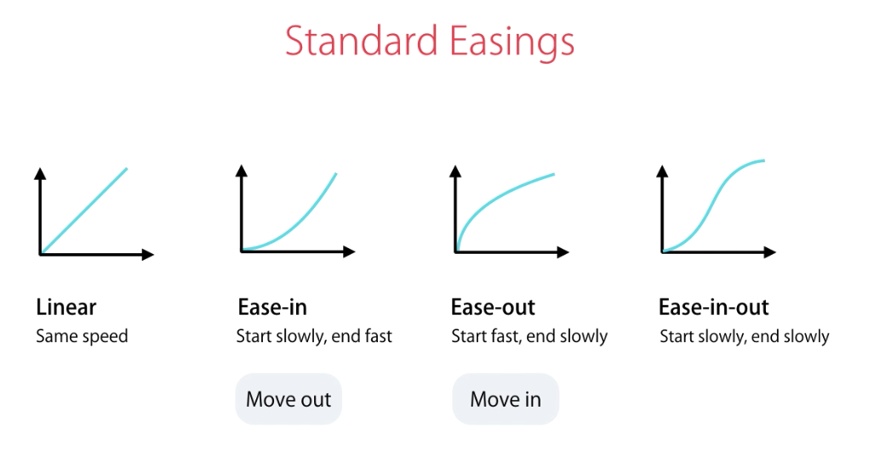
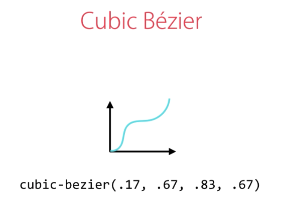

## Animations
* There are two ways to animate DOM elements
    1. CSS
        * using either custom CSS properties or by using the ```animate.css``` library.
            * https://animate.style/
            * Excellent resource for CSS animations: 
                * https://animista.net/play/basic
        * This approach is suitable for one-off, short-lived simple animations - such as: toggling UI component states or showing a 'tool tip'.
    2. JavaScript
        * We use JS when we need to build richer, more complex animations that require finer control.
        * There are a few animation JS libaries out there (such as JQuery)
            * The Web Animations API (WAAPI) is JavaScripts native API for performing animations
                * Good [article](https://css-tricks.com/css-animations-vs-web-animations-api/) comparing WAAPI with CSS animations.
* In Angular, there is a ```@angular/animations``` module that builds on top of the Web Animations API.
    * This abstraction makes it easier to unit test and port to other platforms (think mobile).
* An 'animation' is a transition from one state of a DOM element to another. 

    <br>
    

    <br>

    * There are 3 states that an element can have:
        * Void
            * where an element is not part of the DOM; typically when an element has been created but not added to the DOM, or when it has been removed from the DOM.
        * Default (```*```)
        * Custom
* Implementing Animations
    * In the component's metadata (```@Component{ }```), there is an optional ```animations``` field that we can supply with an array of 'triggers' - which is a name and an implementation. We can then reference that trigger in our template by using ```@<TRIGGER_NAME>```.
        * example:
            ```typescript
                @Component({
                    animations: [
                        trigger('fadeIn', [
                            state(...),
                            transition(...)
                        ])
                    ]
                })
            ```
            ```html
                <div @fadeIn></div>
            ```
* For this section, my examples can be found in ```../exercises/exercise-animations/examples```.
    * Notes:
        * remember to import ```BrowserAnimationsModule``` into ```app.module.ts``` from ```@angular/platform-browser/animations```
        * Angular animations are built upon the Web Animations API, which varies in its support across the browsers - to plug the gaps in the less supported browsers (like Safari), we use 'Polyfills'.
            * A Polyfill is a piece of code that allows you run new JavaScript features in old browsers - that wouldn't natively support them.
                * There is a ```src/polyfills.ts``` file that lets you 'comment in' the bits you need.
* Implementing Fade In and Out
    * example:
        ```html
            <!-- todos.component.html -->
            <div *ngIf="items" class="list-group" >
                <button type="button"
                    @fade
                    *ngFor="let item of items"
                    (click)="removeItem(item)"
                    class="list-group-item">
                    {{ item }}
                </button>
            </div> 
        ```
        ```typescript
            // todos.component.ts
            @Component({
                selector: 'todos',
                templateUrl: './todos.component.html',
                styleUrls: ['./todos.component.css'],
                animations: [
                    trigger('fade', [
                    // fade in
                    transition("void => *", [
                        style({ backgroundColor: 'yellow', opacity: 0}), // applies the style immeadiately
                        // animate(2000, style({ backgroundColor: 'white', opacity: 1})) // applies the style over a period
                        animate(1000) 
                        // animate() w/o a style() arg undoes the style() object set on the line above
                        // returns it to the default state
                    ]),
                    // fade out
                    transition("* => void", [
                        animate(250, style({ opacity: 0 })) 
                    ])
                    ])
                ]
            })
        ```
* state()
    * The ```state()``` function is used to make our code cleaner and more maintainable; by allowing us to define the styling of an element for a particular element state (void, default (```*```), custom).
        * Typically, we only need to define the ```transition()``` but using ```state()``` can help remove duplicate code from the implementation.
        * example
            ```typescript
                // todos.component.ts - BEFORE, without state()
                 @Component({
                    ...,
                    animations: [
                        trigger('fade', [
                            // fade in
                            transition("void => *", [
                                style({ opacity: 0}), 
                                animate(2000)
                            ]),
                            // fade out
                            transition("* => void", [
                                animate(2000, style({ opacity: 0 })) 
                            ])
                        ])
                    ]
                })

                // todos.component.ts - AFTER, with state()
                @Component({
                    ...,
                    animations: [
                        trigger('fade', [
                            state('void', style({ opacity: 0 })),
                            
                            // fade in
                            transition("void => *", [
                                animate(1000) 
                            ]),
                            // fade out
                            transition("* => void", [
                                animate(250) 
                            ])
                        ])
                    ]
                })
            ```
* Transition refactoring
    * We can make our transition implementation even cleaner. 
    * When you have multiple transitions, with the same implementation, you can combine them into the same transition statement.
        * example:
            ```typescript
                // todos.component.ts - BEFORE
                @Component({
                    ...,
                    animations: [
                        trigger('fade', [
                            state('void', style({ opacity: 0 })),
                            
                            // fade in
                            transition("void => *", [
                                animate(1000) 
                            ]),
                            // fade out
                            transition("* => void", [
                                animate(1000) 
                            ])
                        ])
                    ]
                })

                // todos.component.ts - NEATER
                @Component({
                    ...,
                    animations: [
                        trigger('fade', [
                            state('void', style({ opacity: 0 })),
                            
                            // fade in/out
                            transition("void => *, * => void", [
                                animate(1000) 
                            ])
                        ])
                    ]
                })

                // todos.component.ts - EVEN NEATER
                @Component({
                    ...,
                    animations: [
                        trigger('fade', [
                            state('void', style({ opacity: 0 })),
                            
                            // fade in/out
                            transition("void <=> *", [
                                animate(1000) 
                        ])
                    ]
                })
            ```
            * There also exists aliases:
                * ```"void => *"```: ```:enter```
                * ```"* => void"```: ```:leave```
* Creating Reusable Triggers
    * We can create a ```src/app/animations.ts``` file to define our animations so that we can access them globally across the application. If we have lots of animations, we might consider creating a directory to store mutliple (```*.animations.ts```?) files.
    * I would argue this is syntactically neater and probably is best practise, even when you don't need to reuse an animation mutliple times - it reduces noise in the component and separates concerns even further.
    * example:
        ```typescript
            // src/app/animations.ts
            export let fade = trigger('fade', [
                state('void', style({ opacity: 0 })),
                
                // fade in
                transition(":enter", [
                animate(1000) 
                ]),
                // fade out
                transition(":leave", [
                animate(250) 
                ])
            ])

            // todos.component.ts
            import { fade } from '../animations';

            @Component({
                selector: 'todos',
                templateUrl: './todos.component.html',
                styleUrls: ['./todos.component.css'],
                animations: [
                    fade
                ]
            })
        ```
        * recap: creating a reusable component
            1. import the ```BrowserAnimationsModule``` into ```app.module.ts```
            2. define the trigger in ```animations.ts```
            3. include the trigger in the ```animations``` field for the desired component
            4. reference the trigger in the template
* Easing
    * In order to better represent the varying speed of real-world objects, we can use easing to accelerate and deceleration our animations. Easing improves the realism of our animations.
    * When providing the period that we want to ```animate()```, instead of using a :number of miliseconds, we can supply a string in the form: ```"<PERIOD IN ms/s> <DELAY IN ms/s> <EASING>"```. The delay and easing are optional, only the period is required (as a string or a number).
        * example: ```"500ms 1s ease-in"```
        * there is a list of in-built easings:
            * ```linear``` (default) - constant speed
            * ```ease-in``` - starts slow, ends fast (used for moving OUT)
            * ```ease-out``` - starts fast, ends slow (used for moving IN)
            * ```ease-in-out``` - starts slow, ends slow
            * ```cubic-bezier(x1, y1, x2, y2)``` - custom velocity graph based on the 2 coordinates you provide
                * useful tool: https://cubic-bezier.com/
    
    <br>
    

    * note: the direction of travel (in/out) should be the opposite of (```ease-out/in```): when something 'moves out'; we should use ```ease-in``` - when something 'moves in', we should ```ease-out```.

    <br>
    

    <br>

* Keyframes
    * We can define intermediate steps in our CSS animations by using Keyframes.
        * See the [MDN docs](https://developer.mozilla.org/en-US/docs/Web/CSS/@keyframes)
    * There is a ```keyframes()``` function that we use in our 'trigger' and intakes an array of ```style()``` functions - one for each keyframe in our animation. Each of these ```style()``` functions needs an ```offset``` property to define its keyframe position.
        * example:
            ```typescript
                // animations.ts
                export let bounceInLeft = trigger('bounceInLeft', [
                    transition(':enter', [
                        animate('0.5s ease-out', keyframes([
                            style({
                                offset: .2,
                                opacity: 0,
                                transform: 'translateX(-100%)'
                            }),
                            style({
                                offset: 0.8,
                                opacity: 1,
                                transform: 'translateX(20px)'
                            })
                        ]))
                    ])
                ]);
            ```
* Creating Reusable Animations with ```animation()```
    * If you have complex animations, with multiple steps, that you wish to reuse across your application, we can call the ```animation()``` function to create such a reusable animation.
        * We can then use that animation in our triggers, by using ```useAnimation(<ANIMATION_NAME>)```.
        * Using this method, we can keep our triggers separated and therefore more reusable too; we can build custom animations by combining these together.
        * example:
            ```html
                <!-- todos.component.html -->
                <div *ngIf="items" class="list-group" >
                    <button type="button"
                        @todoAnimation
                        ...>
                        {{ item }}
                    </button>
                </div> 
            ```
            ```typescript
                // todos.component.ts
                @Component({
                    ...
                    animations: [
                        trigger('todoAnimation', [
                            transition(':enter', [
                                style({ opacity: 0, backgroundColor: 'lightgreen' }),
                                animate(1000)
                            ]),
                            transition(':leave', [
                                style({ backgroundColor: 'crimson' }),
                                animate(1000),
                                useAnimation(bounceOutLeftAnimation)
                            ])
                        ])
                    ]
                })

                // animations.ts
                export let bounceOutLeftAnimation = animation(
                    animate('0.5s ease-out', keyframes([
                        style({
                            offset: .2,
                            opacity: 1,
                            transform: 'translateX(20px)'
                        }),
                        style({
                            offset: 1,
                            opacity: 0,
                            transform: 'translateX(-100%)'
                        })
                    ]))
                );

                export let slide = trigger('slide', [
                    state('void', style({ transform: 'translateX(-10px)' })),
                    
                    // slide in
                    transition(":enter", [
                        style({ backgroundColor: 'lightgreen' }),
                        animate("500ms cubic-bezier(.88,.34,.13,.7)")
                    ]),
                    // slide out
                    transition(":leave",
                        useAnimation(bounceOutLeftAnimation)
                    )
                ]);
            ```
            * recall, the ```animate()``` function is used to apply a bunch of styles over a period of time; the ```animation()``` function, which would be better described as 'createAnimation()', creates a resuable animation.
* Parameterised Reusable Components
    * When we define custom animation, using ```animation()```, we can parameterise the ```animate()``` values, provide default values in the ```animation()``` function and then override these in the component where we define the trigger.
    * example:
        ```typescript
            // animations.ts
            export let fadeInAnimation = animation([
                style({ opacity: 0, backgroundColor: 'lightgreen' }),
                animate('{{ duration }} {{ easing }}')
            ], {
                params: {
                    duration: '2s',
                    easing: 'ease-out'
                }
            })

            export let fadeOutAnimation = animation([
                style({ opacity: 1 }),
                animate(500)
            ])

            export let fade = trigger('fade', [
                transition(":enter", [
                    seAnimation(fadeInAnimation)
                ]),
                transition(":leave", [
                    useAnimation(fadeOutAnimation)
                ])
            ]);

            // todos.component.ts
            @Component({
                selector: 'todos',
                templateUrl: './todos.component.html',
                styleUrls: ['./todos.component.css'],
                animations: [
                    // fade,
                    // slide,
                    trigger('todoAnimation', [
                        transition(':enter', [
                            useAnimation(fadeInAnimation, {
                            params: {
                                duration: '500ms'
                            }
                            })
                        ]),
                        transition(':leave', [
                            style({ backgroundColor: 'crimson' }),
                            animate(1000),
                            useAnimation(bounceOutLeftAnimation)
                        ])
                    ])
                ]
            })
        ```

