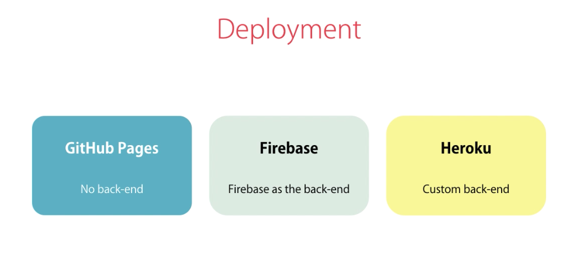

## Deployment
* Deployment Preparation
    * Mosh's example code for this section did not work for me, as much of it has been deprecated.
        * Therefore, I will duplicate and reuse the code from the 'Authentication and Authorisation' section for my example - this can be found in ```../exercises/exercise-deploy/examples```.
    * Optimisation Techniques 
        * There are techniques to reduce the size of your code in order to make deployment smoother. These include:
            * Minification - remove all comments and whitespace
            * Uglification - replacing long, descriptive variable names with short, cryptic ones.
            * Bundling - combining multiple JS files together into a single, larger one; reducing the number of requests that have to be made to download parts of the application.
            * Dead-Code Elimination - removing any sections of code or dependencies that are not actually used anywhere in our application.
            * Ahead-Of-Time (AOT) Compilation
        * The Angular CLI offers us a command to use all of these optimisation techniques: 
            * ```ng build```
                * Note, the ```--prod``` flag has been deprecated; 'production' is now the default config and so we can omit it and still get the optimised build.
* JIT vs AOT Compilation
    * Unlike with the ```javac``` Java Compiler, which converts Java code into bytecode, the Angular compiler converts JavaScript code into JavaScript code.
    * Just-In-Time (JIT) Compilation - this is where compilation happens at runtime. This is fine when we are developing the application on our local machine but is inefficient for production, as every user will have to compile the application when they access it. 
    * Ahead-Of-Time (AOT) Compilation - this is where compilation happens ahead of deployment, so that users do not have to compile the application when they access it. The benefits of AOT compilation include:
        * Faster start up (don't have to wait to compile)
        * Smaller bundle size (Angular Compiler doesn't need to be included in the 'vendor' bundle)
        * Catch template error earlier (JIT means that template errors are only caught at runtime)
        * Better security (less vulnerable to injection attacks in our app)
* Building Applications With Angular CLI
    * In our ```package.json``` file, we have a ```@angular/compiler-cli``` dependency.
    * Using the ```ng build``` command builds our application into a deployable package and applies the optimisation techniques discussed above. 
        * This creates a ```/dist``` folder (~'distributable/distribution') - containing the ```index.html```, stylesheet and JS bundles.
* Environments
    * In ```/src/environments``` we define configuration for our Angular app depending on which environment we are running in (dev, staging, prod, etc).
        * It is akin to ```app.yaml``` in Spring-world; where we can supply different profiles at runtime, to modify the behaviour of our application.
    * For example, we may wish to change the colour of a component to signify that a 'test user' is looking at the version of the app running in the 'test environment' - this confirms that they are not going to accidentally modify the production instance.
    * To use an environment variable, we first define it in the desired ```src/environments/environment.<ENVIRONMENT_NAME>.ts``` file.
        * Next, in the desired component, we ```import { environment } from 'src/environments/environment';``` and reference the environment variable using ```varName = environment.varName;```. We are then free to use this in our component; such as in a style binding expression in the template.
            * Finally, we use ```ng build/serve --configuration <ENVIRONMENT_NAME>``` to specify which environment to use in our build. 
                * Alternatively, we can use ```-c``` alias for ```--configuration```.
    * Note:
        * ```ng build``` selects the 'production' environment by default
        * ```ng serve``` selects the 'development' environment by default
        * To use a custom ```environment.<ENVIRONMENT_NAME>.ts``` file, you must register it in ```/angular.json```; this is under both the ```'configurations:'``` (```ng build```) and ```'serve:'``` (```ng serve```) sections.
            * [useful article](https://www.freakyjolly.com/how-to-add-create-new-environments-in-angular-12-application/)
            * see the example below
        * The Angular docs refer to the 'staging' environment file using ```environment.stage.ts``` - not 'environment.staging.ts'.
            * It appears the file names use shorthand, instead of the full environment name - like ```environment.prod.ts``` vs 'production'.
        * When using a non-'development' environment, we lose 'hot-module-replacement' (HMR); therefore, if we make changes to our code, we have to manually restart the server.
            * I think HMR has actually been implemented in non-'development' environments in more recent versions of Angular - it certainly worked when I tested it with ```-c production```.
    * example:
        ```html
            <!-- home.component.html -->
            ...
            <p 
                [style.color]="textColor"
                *ngIf="authService.isLoggedIn()">
                Welcome {{ authService.currentUser.name }}
            </p>
        ```
        ```typescript
            // home.component.ts
            import { environment } from 'src/environments/environment';
            ...
            export class HomeComponent {
                textColor = environment.textColor;
                ...
            }

            // environment.ts
            export const environment = {
                production: false,
                textColor: 'blue'
            };

            // environment.stage.ts
            export const environment = {
                production: false,
                textColor: 'green'
            };

            // environment.prod.ts
            export const environment = {
                production: true,
                textColor: 'red'
            };
        ```
        ```json
            "/angular.json"

            "architect": {
                "build": {
                "builder": "...",
                "options": {
                    "..."
                },
                "configurations": {
                    "production": {
                    "budgets": [
                        {
                        "type": "initial",
                        "maximumWarning": "500kb",
                        "maximumError": "1mb"
                        },
                        {
                        "type": "anyComponentStyle",
                        "maximumWarning": "2kb",
                        "maximumError": "4kb"
                        }
                    ],
                    "fileReplacements": [
                        {
                        "replace": "src/environments/environment.ts",
                        "with": "src/environments/environment.prod.ts"
                        }
                    ],
                    "outputHashing": "all"
                    },
                    "development": {
                    "buildOptimizer": false,
                    "optimization": false,
                    "vendorChunk": true,
                    "extractLicenses": false,
                    "sourceMap": true,
                    "namedChunks": true
                    },
                    "staging": {
                    "fileReplacements": [
                        {
                        "replace": "src/environments/environment.ts",
                        "with": "src/environments/environment.stage.ts"
                        }
                    ]
                    }
                },
                "defaultConfiguration": "production"
                },
                "serve": {
                "builder": "@angular-devkit/build-angular:dev-server",
                "configurations": {
                    "production": {
                    "browserTarget": "examples:build:production"
                    },
                    "development": {
                    "browserTarget": "examples:build:development"
                    },
                    "staging": {
                    "browserTarget": "examples:build:staging"
                    }
                },
                "defaultConfiguration": "development"
                }
        ```
        ```bash
            # environment.ts
            ng serve 
            ng build --configuration development

            # environment.stage.ts
            ng serve -c staging 
            ng build -c staging 

            # environment.prod.ts
            ng serve -c production 
            ng build 
        ```
* Linting with Angular CLI
    * A Linter is a tool that performs a static analysis of your code to see if it breaks any of the rule that have been configured.
        * This is done to ensure that code is clean and consistent; which is essential when working in a development team, where maintainability could be affected by contrasting programming styles.
    * In Angular with use 'ESLint' (ECMAScript) to lint our code base - ESLint replaced TSLint a few years ago.
        * ```ng add @angular-eslint/schematics```
        * ```ng lint```
            * note: there are VS Code linting plugins: the ESLint plugin seemed buggy to me (have a play around in the future).
            * TSLint seemed better; ```--fix``` flag not present in ESLint? (for auto-correcting basic issues).
    * We should lint our code before each pull request; it is a good habit to lint often (before each commit?).
* Deployment Options
    * Copy the ```/dist``` folder to a non-development machine and run ```ng serve```
    * GitHub pages
        * free web hosting, suitable if there is no backend; perhaps you consume public API's or a different team completely manages the backend for you separately and you simply consume the API.
            * Note, the repo must be public for standard accounts; you may use a private repo if the account is 'PRO'.
            * Steps:
                * create a new repo and clone to your development machine
                * create a new app using ```ng``` cli
                * ```ng add angular-cli-ghpages```
                * ```ng deploy --base-href=/<REPOSITORY_NAME>/```
                    * remember to include the trailing ```/``` after ```<REPOSITORY_NAME>```
                    * see my example: https://github.com/JRSmiffy/angular-ghp-example
                    * good tutorial: https://github.com/angular-schule/angular-cli-ghpages 
    * Firebase
        * Google-managed cloud service for building backends easily and quickly. Offers a database and a library to work with that database, so we don't have to write API's from scratch.
        * Steps:
            * Create a project at https://console.firebase.google.com/
            * in your project folder, locally:
                *  ```npm i -g firebase-tools```
                * ```firebase login```
                * ```firebase init```
                    * I selected 'Hosting: Configure files for Firebase Hosting and (optionally) set up GitHub Action deploys', using ```space-bar```
                    * Then, I selected the project that I created on the firebase-console; selecting ```y``` on the 'Configure as a single-page app (rewrite all urls to /index.html)?' option and setting the 'public directory' as ```dist/examples```.
                * ```ng build```
                * ```firebase deploy```
                    * gives us a 'Hosting URL'
            * Good Stack Overflow [post](https://stackoverflow.com/questions/51842885/firebase-deploy-complete-but-website-not-shown)
    * Heroku / Cloud Foundry (PaaS, Platform as a Service)
        * Mosh uses Heroku - I prefer Pivotal Cloud Foundry, as it is what I have used before.
            * Notes for deploying to Heroku (consider that this approach may be deprecated - I skipped this exercise)
                * install heroku cli
                * move the ```typescript```, ```@angular/cli``` and ```@angular/compiler-cli``` dependencies from 'devDependencies' to 'dependencies' in ```package.json```.
                * add a 'server.js' file that uses 'express' - I've included this in the ```/examples``` directory.
                * in the 'scripts' sections of ```package.json```, add: ```"postinstall": "ng build"``` and replace ```"start": "ng serve``` with ```"start": "node server.js"```
            
    * Docker / Kubernetes? - There are tutorials out there.

    <br>
    

    <br>

* We can create custom commands in ```package.json```, under the 'scripts' section.
    * example:
        ```json
            "package.json"
            "scripts": {
                "ng": "ng",
                "start": "ng serve",
                "build": "ng build",
                "watch": "ng build --watch --configuration development",
                "test": "ng test",
                "lint": "ng lint",
                "deploy:firebase": "ng build && firebase deploy"
            }
        ```
        * run using: ```npm run deploy:firebase```