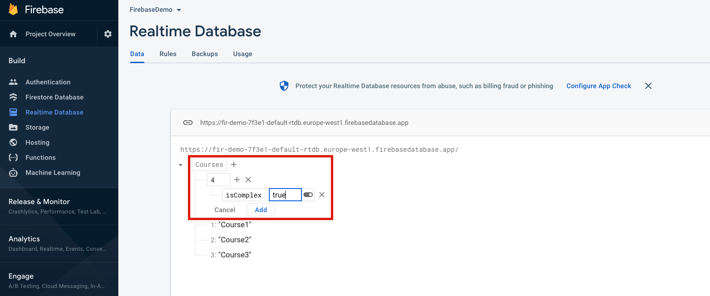

## Building Real-time Serverless Apps with Firebase
* Firebase allows us to very quickly build a backend for our Angular applications, with:
    * A fast, scalable and real-time database in the cloud
    * Authentication
    * Cloud Messaging (notification, etc)
    * Storage
    * Analytics
* Firebase is a **BaaS** (Backend-as-a-Service)
* It is used in the tech-stacks of several large companies
    * including:
        * The New York Times
        * The Economist
        * Venmo
        * Twitch
        * Alibaba
        * Accenture
        * Lyft
    * [source](https://careerkarma.com/blog/companies-that-use-firebase/)
    * So it is probably worth taking seriously
* Firebase offers many feature for free, if your app grows they offer paid services: 
    * https://firebase.google.com/pricing
* Getting Started:
    * The Firebase console can be found at: 
        * https://console.firebase.google.com/
    * From the console we can create a new project
* Firebase Databases:
    * In general, we have two types of databases:
        * SQL (relational)
            * A SQL database (like MySQL or PostgreSQL) has a schema; that is a collection of tables and the relationships between them - a table is a logical group of columns with records/rows.
        * NoSQL (non-relational, non-tabular, document)
            * A NoSQL database (like MongoDB, CouchDB or Firebase) doesn't have a schema; it is tree of nodes - each node being a key:value pair. The value can be a primitive value or a complex object.
    * We can very easily create a Real-time Database in Firebase by going to the 'Realtime Database' section. It it straightforward to add records into our database.
        * Note, because Firebase is NoSQL (schema-less), our objects do not have to follow any kind of structure or be consistent with nested siblings.
            * SQL databases are optimised for reporting, we can run complex queries against multiple tables to retrieve data. Whereas, NoSQL is quick and flexible but doesn't allow us to query at the same level.

        <br>

        

        <br>

* Installing Firebase (Angular)
    * In this section, my examples can be found in ```../exercises/exercise-firebase/examples```
    * Steps:
        * ```npm i firebase```
        * ```ng add @angular/fire```
            * https://github.com/angular/angularfire
            * I selected these setup features: 
                * ng deploy -- hosting
                * Authentication
                * Firestore
                * Realtime Database
            * This will automatically import the right modules into ```app.module.ts``` and point the ```environment.ts``` at our Firebase project in the cloud.

