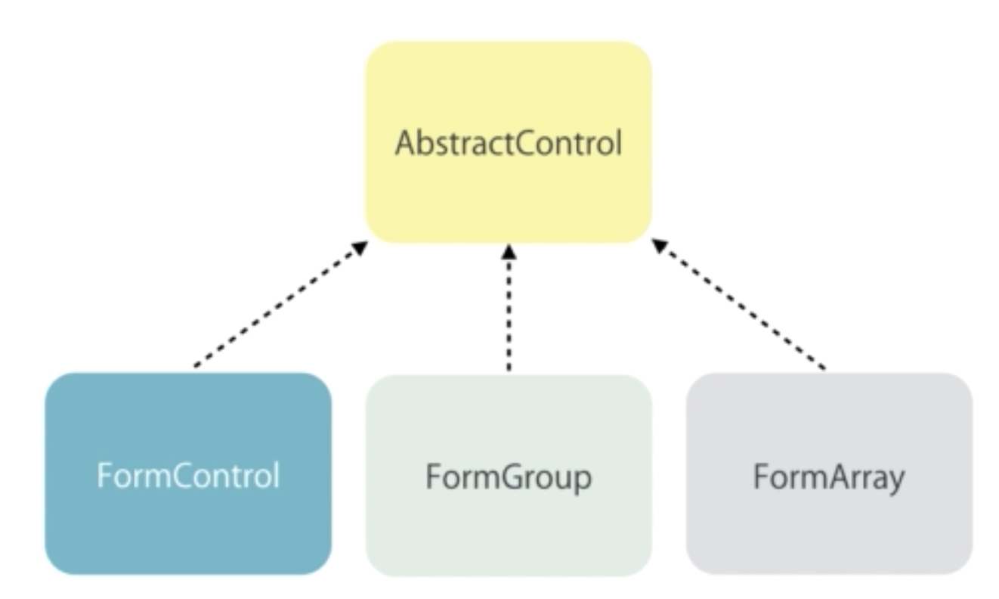

## Reactive Forms
* With Reactive Forms, form objects are explicitly created by the developer in the component; unlike Template-driven Forms, where we use directives in the template to enable Angular to create ```FormControls/Group``` objects for us.
    * In other words - with Reactive Forms, we define the ```AbstractControl``` objects that make up our form in the component; rather than relying on directives (in our template) to automatically create these instances under the hood (Template-driven Forms).
* Why use Reactive Forms?
    * We create Reactive forms when we want finer control over the structure and behaviour of the forms.
    * They are also easier to unit test.
* Reactive Forms are required when we want to dynamically render a form, based on an object structure that we retrieve from a backend service. 
* Creating Controls Programmatically
    * The class ```AbstractControl``` is the base class for ```FormControl``` and ```FormGroup``` - they both extend it.
        * ```FormArray``` also extends ```AbstractControl```.
                    
        <br>
        
        
        <br>
    * steps:    
        1. import ```FormsModule``` and ```ReactiveFormsModule``` into ```app.module.ts```
        2. Create the ```FormGroup``` and nested ```FormControl``` objects, programmatically (```form = new FormGroup(...)```), in your form component
        3. Property bind the ```[formGroup]=<FORM_PROPERTY>``` directive to your form property on the ```<form>``` tag and apply the ```formControlName=<FORM_PROPERTY_FIELD_NAME>``` directive to the ```<input>``` fields that correspond to each field in your form object.
    * example:
        * this example is in ```../exercises/exercise-course-form/my-soln```
        ```html
            <!-- signup-form.component.html -->
            <form [formGroup]="form">
                <div class="form-group">
                    <label for="username">Username</label>
                    <input 
                        formControlName="username"
                        id="username" 
                        type="text" 
                        class="form-control">
                </div>
                <div class="form-group">
                    <label for="password">Password</label>
                    <input 
                        formControlName="password"
                        id="password" 
                        type="text" 
                        class="form-control">
                </div>
                <button class="btn btn-primary" type="submit">Sign Up</button>
            </form>
        ```
        ```typescript
            // signup-form.component.ts
            export class SignupFormComponent {
                form = new FormGroup({
                    username: new FormControl(),
                    password: new FormControl()
                    // note, you can quote these fields
                    // if you need to use special names
                        // e.g 'user-age'
                })
            }
        ```
* Adding Validation
    * With Template-driven Forms, we added validation by using HTML5 validation attributes on our ```<input>``` fields. When working with Reactive Forms, we assign validators upon creating the ```FormControl``` objects in our component.
        * A ```FormControl``` object takes in as one of its optional parameters, a ```Validators``` function or array of ```Validators``` functions - note, we don't call the method, we are referencing the method name only and so drop the ```()```. Even when we do use ```()``` [e.g ```Validators.minlength(3)```], we are returning a Validator function.
            * The ```Validators``` class is part of ```@angular/forms``` and has several static methods:
                * ```Validators.required```
                * ```Validators.minLength(number)```
                * ```Validators.maxLength(number)```
                * ```Validators.pattern(regex)```
                * ```Validators.email```
        * steps:
            1. Assign one or more ```Validators``` functions when creating a ```FormControl``` object in the component
            2. Use ```<div *ngIf="property.touched && property.invalid">``` to render error messages in the template
            3. Use component getters to clean up the code
        * example:
        ```html
            <!-- signup-form.component.html -->
            <form [formGroup]="form">
                <div class="form-group">
                    <label for="username">Username</label>
                    <input 
                        formControlName="username"
                        id="username" 
                        type="text" 
                        class="form-control">
                    <div 
                        *ngIf="username?.touched && username?.invalid"
                        class="alert alert-danger">
                        Username is required.
                    </div>
                </div>
                <div class="form-group">
                    <label for="password">Password</label>
                    <input 
                        formControlName="password"
                        id="password" 
                        type="text" 
                        class="form-control">
                    <div 
                        *ngIf="password?.touched && password?.invalid"
                        class="alert alert-danger">
                        Password is required.
                    </div>
                </div>
                <button class="btn btn-primary" type="submit">Sign Up</button>
            </form>
        ```
        ```typescript
            // signup-form.component.ts
            ...
            form = new FormGroup({
                username: new FormControl('', Validators.required),
                password: new FormControl('', Validators.required)
            })

            get username() {
                return this.form.get('username');
            }

            get password() {
                return this.form.get('password');
            }
        ```
* Adding Specific Validation Errors
    * example
        ```html
            <!-- signup-form.component.html -->
            <form [formGroup]="form">
                <div class="form-group">
                    <label for="username">Username</label>
                    <input 
                        formControlName="username"
                        id="username" 
                        type="text" 
                        class="form-control">
                    <div 
                        *ngIf="username?.touched && username?.invalid"
                        class="alert alert-danger">
                        <div *ngIf="username?.errors?.['required']">
                            Username is required.
                        </div>
                        <div *ngIf="username?.errors?.['minlength']">
                            Username must be minimum {{ username?.errors?.['minlength'].requiredLength }} characters.
                        </div>
                    </div>
                </div>
                ...
            </form>
        ```
        ```typescript
            // signup-form.component.ts
            ...
            form = new FormGroup({
                username: new FormControl('', [
                    Validators.required,
                    Validators.minLength(6)
                ]),
                password: new FormControl('', Validators.required)
            })
            ...
        ```
* Implementing Custom Validation
    * There is an interface called ```ValidatorFn``` that defines how we must create our own custom implementation of a validator.
    * In our component directory, we should create a ```Validators``` class that encapsulates all of the validators for a particular field.
        * example: ```src/app/common/validators/username.validators.ts```
            * as a best practise, we should put it in ```src/app/common/validators``` to make it neatly accessible across the whole application.
    * example:
        ```html
            <!-- signup-form.component.html -->
            <form [formGroup]="form">
                <div class="form-group">
                    <label for="username">Username</label>
                    <input 
                        formControlName="username"
                        id="username" 
                        type="text" 
                        class="form-control">
                    <div 
                        *ngIf="username?.touched && username?.invalid"
                        class="alert alert-danger">
                        <div *ngIf="username?.errors?.['required']">
                            Username is required.
                        </div>
                        <div *ngIf="username?.errors?.['minlength']">
                            Username must be minimum {{ username?.errors?.['minlength'].requiredLength }} characters.
                        </div>
                        <div *ngIf="username?.errors?.['cannotContainSpace']">
                            {{ username?.errors?.['cannotContainSpace'].message }}
                        </div>
                    </div>
                </div>
                ...
            </form>
        ```
        ```typescript
            // signup-form.component.ts
            ...
            form = new FormGroup({
                username: new FormControl('', [
                    Validators.required,
                    Validators.minLength(6),
                    UsernameValidator.cannotContainSpace
                ]),
                password: new FormControl('', Validators.required)
            })
            ...

            // src/app/common/validators/username.validators.ts
            import { AbstractControl, ValidationErrors } from "@angular/forms";

            export class UsernameValidator {

                static cannotContainSpace(control: AbstractControl): ValidationErrors | null {
                    if ((control.value as string).indexOf(' ') != -1)
                        return { cannotContainSpace: {
                                    message: "Username cannot contain spaces."
                                }};
                    
                    return null;
                }
            }

            // if ((control.value as string).indexOf(' ') != -1) 
                // this tests if our string contains a space
                    // alt: ((control.value as string).indexOf(' ') >= 0)
        ```
* Asynchronous Operations & Validators
    * If an operation is 'asynchronous', it means that it happens in parallel to other operations of the application - other operation can take place without waiting for this one to complete. 
        * This is essential for requests to a backend service, as there may be a connection delay in the order of the seconds, that otherwise would completely block the user's control.
            * Asynchronous is analogous with 'non-blocking'  - the process that executes the code doesn't block whilst waiting.
        * Both AJAX requests and timer functions are async in JavaScript - in our exmaple, we can use ```setTimeout()``` to simulate a AJAX request.
    * In some instances, we need to call the server to validate a given value
        * A good example of this is validating whether the inputted username is already taken or not.
        * This requies a custom validator.
    * Asynchronous Validators
        * To use asynchronous validators we need to leaverage the third parameter in the ```new FormControl(...)``` constructor; which is specifically for ```AsynValidator```.
        * example:
            ```html
                <!-- signup-form.component.html -->
                <form [formGroup]="form">
                    <div class="form-group">
                        <label for="username">Username</label>
                        <input 
                            formControlName="username"
                            id="username" 
                            type="text" 
                            class="form-control">
                        <div 
                            *ngIf="username?.touched && username?.invalid"
                            class="alert alert-danger">
                            <div *ngIf="username?.errors?.['required']">
                                Username is required.
                            </div>
                            <div *ngIf="username?.errors?.['minlength']">
                                Username must be minimum {{ username?.errors?.['minlength'].requiredLength }} characters.
                            </div>
                            <div *ngIf="username?.errors?.['cannotContainSpace']">
                                {{ username?.errors?.['cannotContainSpace'].message }}
                            </div>
                            <div *ngIf="username?.errors?.['shouldBeUnique']">
                                {{ username?.errors?.['shouldBeUnique'].message }}
                            </div>
                        </div>
                    </div>
                    ....
                </form>
            ```
            ```typescript
                // signup-form.component.ts
                ...
                  form = new FormGroup({
                    username: new FormControl(
                    '', [
                    Validators.required,
                    Validators.minLength(6),
                    UsernameValidator.cannotContainSpace], 
                    UsernameValidator.shouldBeUnique),
                    password: new FormControl('', Validators.required)
                })
                ...

                // src/app/common/validators/username.validators.ts
                ...
                static shouldBeUnique(control: AbstractControl) : Promise<ValidationErrors | null> {
                    return new Promise((resolve, reject) => {
                        setTimeout(() => { // simulate AJAX delay
                            if (control.value === 'JRSmiffy')
                                resolve({ shouldBeUnique: {
                                    message: 'Username \'' + control.value + '\' is already taken.'
                                }});
                            else 
                                resolve(null);
                        }, 2000); // delay for 2 seconds
                    });
                }
            ```
    * Showing a Loader Image
        * This improves usability whilst an async operation is pending
        * We use the ```.pending``` property of our form object to determine the state - it returns ```true``` if at least one ```AsyncValidator``` is in-progress.
        * example:
            ```html
                <!-- signup-form.component.html -->
                <form [formGroup]="form">
                    <div class="form-group">
                        <label for="username">Username</label>
                        <input 
                            formControlName="username"
                            id="username" 
                            type="text" 
                            class="form-control">
                        <span 
                            *ngIf="username?.pending" 
                            class="glyphicon glyphicon-refresh glyphicon-refresh-animate">
                        </span>
                        <div 
                            *ngIf="username?.dirty && username?.invalid"
                            class="alert alert-danger">
                            <div *ngIf="username?.errors?.['required']">
                                Username is required.
                            </div>
                            <div *ngIf="username?.touched && username?.errors?.['minlength']">
                                Username must be minimum {{ username?.errors?.['minlength'].requiredLength }} characters.
                            </div>
                            <div *ngIf="username?.touched && username?.errors?.['cannotContainSpace']">
                                {{ username?.errors?.['cannotContainSpace'].message }}
                            </div>
                            <div *ngIf="username?.errors?.['shouldBeUnique']">
                                {{ username?.errors?.['shouldBeUnique'].message }}
                            </div>
                        </div>
                    </div>
                    ...
                </form>
            ```
* Validating Input Upon Submit
    * Should you handle validation in the frontend or backend?
        * good Stack overflow [post](https://stackoverflow.com/questions/37492271/should-i-handle-html-form-validation-on-front-or-backend#:~:text=You%20should%20always%20check%20the,way%20to%20have%20sane%20data.)
            * TLDR:
                * Ideally both, backend validation is a must.
                * Frontend validation is to improve usability, backend is to have 'sane' data.
    * A good example of getting the server to validate input is for a login; we need the backend service to confirm whether the username and password are valid credentials. This can't be done in the frontend because the credentials come from the database.
    * To do this, we handle the ```ngSubmit``` event that results from the ```ngForm``` (linked to the ```<form>``` element). We use event binding to bind the ```ngSubmit``` event raised by ```ngForm``` to a method in our component.
    * example;
        ```html
            <!-- signup-form.component.html -->
            <form [formGroup]="form" (ngSubmit)="login()">
                <div 
                    *ngIf="form.errors"
                    class="alert alert-danger">
                    Username or password is invalid.
                </div>
                <div class="form-group">
                    ...
                </div>
                ...
            </form>
        ```
        ```typescript
            // signup-form.component.ts
            ...
            export class SignupFormComponent {
                form = new FormGroup({
                    ...
                })
                authService = new AuthService();
                ...

                login() {
                    let isValid = this.authService.login(this.form.value);

                    if (!isValid) {
                        this.form.setErrors({
                            invalidLogin: true
                        })
                    }
                }

            }

            // for demo puposes
            class AuthService {

                constructor() { }

                login(credentials: Object) {
                    console.log(credentials);
                    // HTTP Request
                    return false; // invalid login
                }

            }
        ```
* Nested FormGroups
    * When building complex forms, it may be necessary to have ```FormGroup```'s nested inside a ```FormGroup``` - perhaps we are building a complex form and ```account``` is a nested ```FormGroup```, with ```username``` and ```password``` controls.
        * We need to use the ```formGroupName=""``` directive on a ```<div>``` that wraps our controls.
        * example:
            ```html
                <!-- signup-form.component.html -->
                ...
                <div formGroupName="account">
                    <div class="form-group">
                        <label for="accountUsername">Account Username</label>
                        <input 
                            formControlName="accountUsername"
                            id="accountUsername" 
                            type="text" 
                            class="form-control">
                    </div>
                </div>
                ...
            ```
            ```typescript
                // signup-form.component.ts
                ...
                form = new FormGroup({
                    username: new FormControl(...),
                    password: new FormControl(...),
                    account: new FormGroup({
                        acccountUsername: new FormControl()
                    })
                })

                ...
                get accountUsername() {
                    return this.form.get('account.accountUsername');
                }
            ```
* FormArray
    * Sometimes we need to work with an array of objects in a form.
    * example:
        ```html
            <!-- signup-form.component.html -->
            ...
            <div class="form-group">
                <label for="topics">Add Topics</label>
                <input 
                    type="text" 
                    class="form-control"
                    #topic
                    (keyup.enter)="addTopic(topic)">
                <ul class="list-group">
                    <li 
                        *ngFor="let topic of topics.controls"
                        (click)="removeTopic(topic)"
                        class="list-group-item">
                        {{ topic.value }}
                    </li>
                </ul>
            </div>
            ...
        ```
        ```typescript
            // signup-form.component.ts
            form = new FormGroup({
                username: new FormControl(...),
                password: new FormControl(...),
                account: new FormGroup({
                acccountUsername: new FormControl(),
                topics: new FormArray([ ])
                })
            })
            
            ... 

            get topics() {
                return this.form.get('account.topics') as FormArray;
            }

            addTopic(topic: HTMLInputElement) {
                this.topics.push(new FormControl(topic.value));
                topic.value = '';
            }

            removeTopic(topic: AbstractControl) {
                let index = this.topics.controls.indexOf(topic);
                this.topics.removeAt(index);
            }
        ```
* FormBuilder
    * Using the ```FormBuilder``` class is another method to create forms; arguably this syntax is slightly cleaner. Be comfortable working with both methods.
    * example:
        ```typescript
            // new-course-form.component.ts
            export class NewCourseFormComponent {

                formOriginal = new FormGroup({
                    name: new FormControl('', Validators.required),
                    contact: new FormGroup({
                    email: new FormControl(),
                    phone: new FormControl()
                    }),
                    topics: new FormArray([])
                });

                form: FormGroup;

                constructor(fb: FormBuilder) { 
                    this.form = fb.group({
                    name: ['', Validators.required],
                    contact: fb.group({
                        email: [],
                        phone: []
                    }),
                    topics: fb.array([])
                    })
                }

            }
        ```
* Recap
    * With Reactive Forms, we define the ```AbstractControl``` objects that make up our form in the component; rather than relying on directives (in our template) to automatically create these instances under the hood (Template-driven Forms).
    * We can create our form object using one of two methods
        1. manually building an object as a component field
        2. using ```FormBuilder``` in the constructor
    * Once we have created our form object in the component, we use directives to associate each ```AbstractControl``` object to an element in our template.
        * The directives are:
            * ```formGroup```: which we property bind on the ```<form>``` tag to the form object in our component
                * example: ```<form [formGroup]="form">```
            * ```formControlName```: which acts as an attribute on an ```<input>``` tag to associate the element with a ```FormControl``` object.
                * example: ```<input formControlName="username">```
            * ```formGroupName```: which acts as an attribute on an ```<div>``` tag to associate the element with a ```FormGroup``` object (which is a nested sub-group of related controls).
                * example: ```<div formGroupName="contact">```
    * If we have a ```FormArray``` in our form, we can use the ```*ngFor``` directive to iterate over the controls in that array and render them on the form.
* Change Password Form Exercise
    * see ```../exercises/exercise-change-password-form/my-soln``` for my initial solution
    * see ~~```../exercises/exercise-change-password-form/mosh-soln```~~ for Mosh's better solution
        * ~~our solutions were too similar to warrant creating a separate project~~
        * notes:
 


