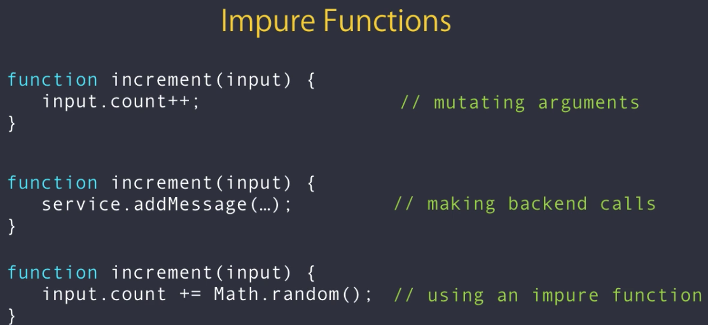
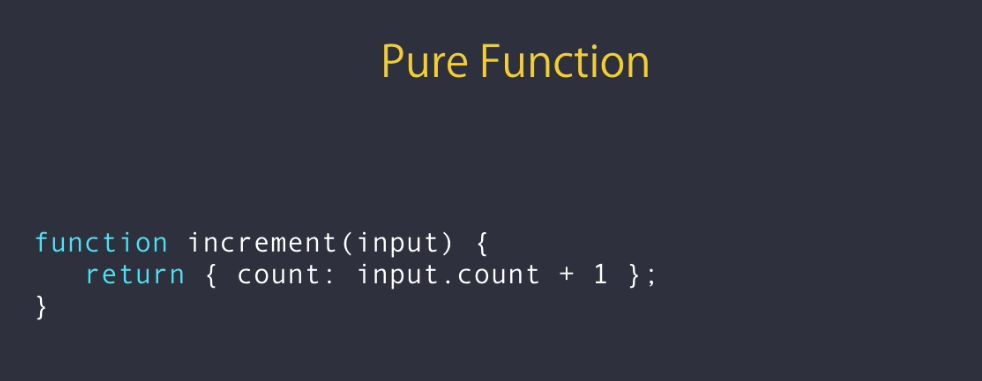
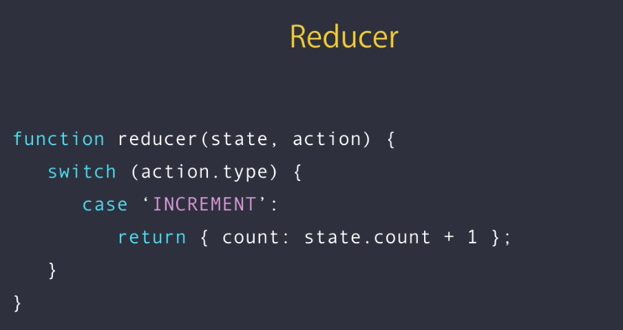
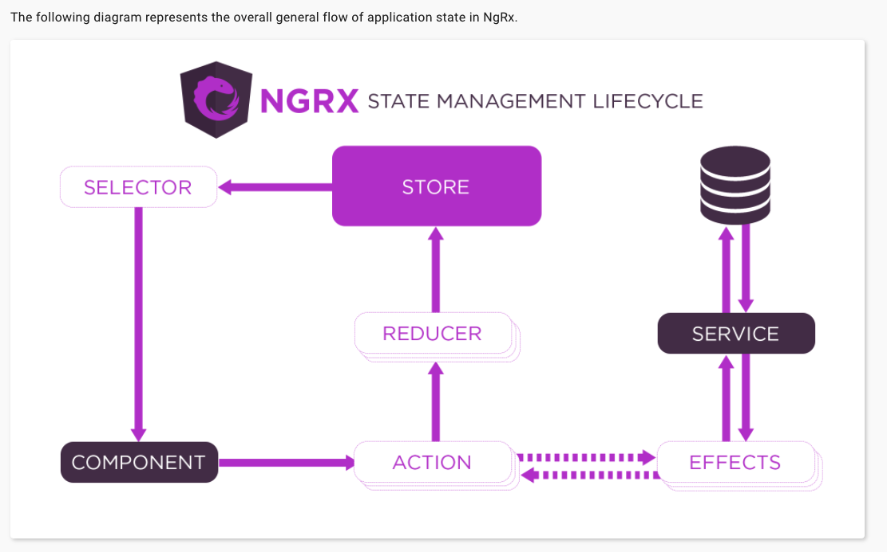
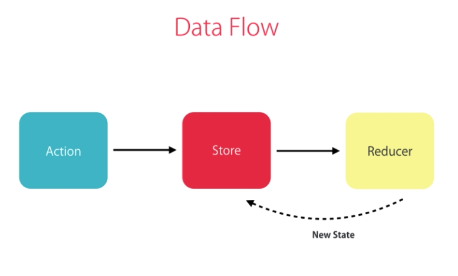
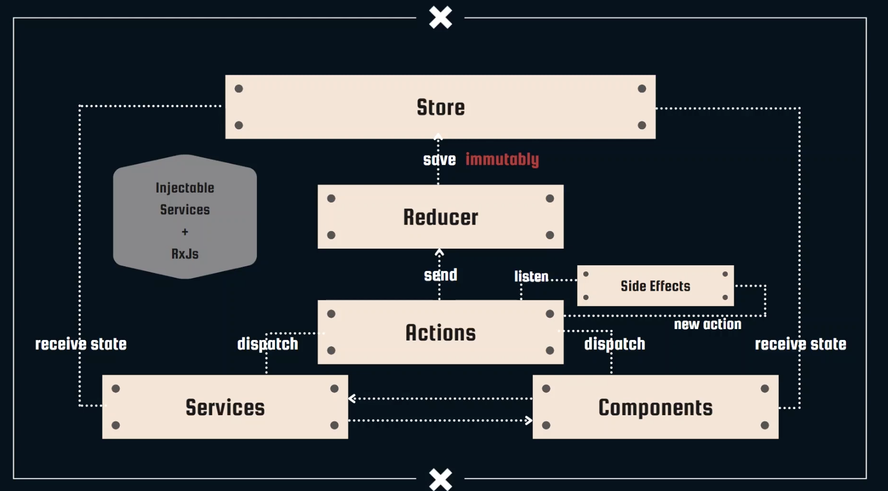
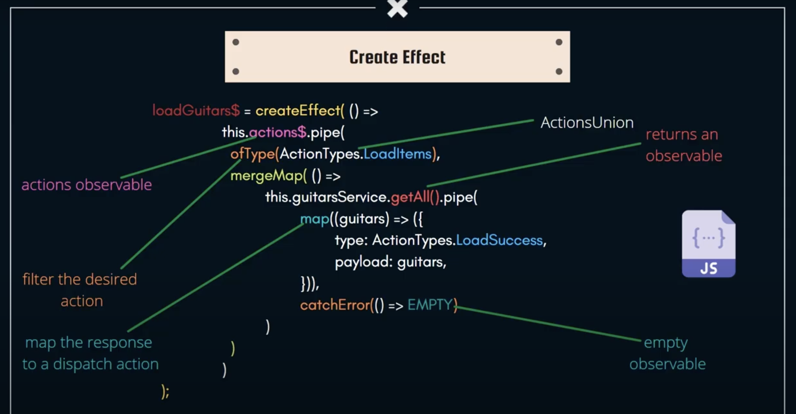

## Redux
*A Predictable State Container for JS Apps*
* What is Redux?
    * Redux is a library to help you manage the state of your application.
        * It is something that you should consider using when you're working with a medium-to-large single page application with complex data flows.
            * In small/simple apps, using Redux would add unnecessary complexity.
                * We can always start without Redux and then as it grows in complexity, refactor it and add Redux later on.
                    * Although, I'd like to practise with it, even on small personal projects.
        * Redux is a predictable state container for JS apps.
    * Large Single Page Apps
        * A component manages the logic and state behind a view (section of the screen). This model perfectly alligns with the OOP principle of encapsulation. However, this model doesn't work so well when multiple unrelated views are working with the same piece of data. 
            * In this case, we often have copies of the same data across each view and therefore have to do some extra work to sync the data in other views when we change a copy of the data in one view. You could use events to sync the view but this will grow to be too complex in a large application. It is also unpredictable and hard to maintain/extend.
                * Think of Facebook as an example. On the screen we have mulitple views that show you data related to messaging; let's say we are on the messages page, we'll have the number of unread message on the main section of the screen - plus it will also be part of the notifications in the nav bar and part of any open message tabs at the bottom of our screen. It is situations like this when we need to use Redux.
                    * Flux was an architecture that was design by Facebook; Redux is a lightweight implementation of this.
    * Redux Benefits:
        * Redux allows us to manage application state in a predictable way.
        * Redux has a decoupled architecture and so is independent of the presentation framework that we choose to use. This allows for one of Uncle Bob's clean architecture principles: delay the decision about external frameworks and libraries. We can choose to use either React or Angular, etc (no locked-in to one).
        * Redux also improves testability (relies heavily on Functional Programming concepts, avoids the need for mocks, spies, etc).
        * Great tooling - especially debugging.
        * Undo / redo features.
    * When to use Redux:
        * Scenarios:
            * Independent copies of the same data in multiple places
            * Multiple views that need to work with the same data and be in-sync
            * The same data can be updated by multiple users / actions
        * According to [this](https://www.stackchief.com/blog/Why%20you%20should%20NEVER%20use%20Redux%20with%20Angular) article, you should avoid using Redux with Angular. This is because it was design to solve problems in React and Angular doesn't need it. 
            * According to [this](https://blog.angular-university.io/angular-2-redux-ngrx-rxjs/) Angular University blog, Redux is good to use with Angular.
* Building Blocks of Redux
    * There are three building blocks of Redux
        * Store
            * A single JS object that contains the state of the application; akin to a local, client-side database. Different views (components) use different parts / slices of the store and if they need to work on the same slice, it means there is only one copy of the data. Changes made by one component to the slice are visible to other components using that slice. We don't need to be concerned about using too much memory, unless we are storing 1000's of objects.
        * Actions
            * Plain JS objects that represent something that has happened in the application. Actions in Redux are symantically 'events' - in CQRS architecture (Command and Query Responsibility Segregation), 'commands' represent something that can happen (like posting a message), 'events' (Actions, in Redux) represent something that has already happened (like a message has been posted).
        * Reducers
            * A function that specifies how the state changes in response to an action. It can be thought of as an event/action handler that determines how we should change the state. A Reducer does not modify the state, it only returns a new state - the store will then internally update the state. No where in the application do we directly modify the state; that is the responsibility of the store.
* Pure Functions
    * A Function is said to be Pure if it meets the two conditions below; if so, it is analogous to a mathematical function - Good [reading](https://en.wikipedia.org/wiki/Pure_function)
        1. Given the same input, the function always returns the same output - regardless of how many times we call it.
            * A Pure Function should not mutate/modify any of its arguments; or use functions, such as Date.now() or Math.random(), which change each time the function is called.
        2. The function has no side effects. 
            * An example of this is making calls to a backend service.
    * Pure Functions are not equivalent to Idempotency - good Stack Overflow [post](https://stackoverflow.com/questions/4801282/are-idempotent-functions-the-same-as-pure-functions)

    <br>

    
    
    <br>

    
    
    <br>

    * Reducers as Pure Functions
        * Reducer functons in Redux are always pure. They take in the application state and an action; then based on the action type, the return a new state. 

        <br>

        
        
        <br>

        * This is a Functional Programming approach and has a few benefits:
            * Easy to test
                * No mocks, spies or tricks required. Just a simple assertion about the output.
            * Easy undo/redo
                * We can support these features because we keep the previous state, instead of modifying it.
            * Time Travel Debugging
                * We can 'travel back in time' and check our application state, as different actions are triggered in the application. We can see how the application state is modified at each step.
* Installing Redux
    * My examples for this section can be found in ```../exercises/exercise-redux/examples```
     * The most popular Redux library for Angular is NGRX.
        * Useful resources:
            * https://ngrx.io/guide/store

            <br>

            
            
            <br>

    * Steps
        * Create an Angular app
            * ```ng new <APP_NAME>```
        * Install Redux
            * ```npm install @ngrx/store```
* Working with Actions
    * When using Redux, we don't modify the state of our application in the component. 
        * Instead we use an Action, which goes to the Store. The Store knows the right Reducer to call; in the Reducer a new state is returned, depending on the type of the Action. The Store uses this new state to update itself.

    <br>

    
    
    <br>

    * To make a change to the state of our app from our component, we inject a ```Store``` object into our component constructor. This ```Store``` object takes in the an interface for our store object - we can define this in ```store.ts```.
    * We dispatch Actions from methods on our component by using ```store.dispatch(<ACTION>)```; with the ```<ACTION()>``` being defined in our ```*.actions.ts``` file - from here these Actions are used in the ```*.reducer.ts``` file to return a new state.
        * I used [this](https://ngrx.io/guide/store) guide as my example
    * example:

        ```html
            <!-- counter.component.html -->
            <p>Current Count: {{ count$ | async }}</p>
            <!-- The 'async' pipe unwraps the Observable for us --> 
            <!-- Therefore we don't have to explicitly unsubscribe from the Observable, so its easy to avoid memory leaks -->
            <button 
                (click)="increment()"
                mat-raised-button color="primary">
                Increment
            </button>
            <button 
                (click)="decrement()"
                mat-raised-button color="accent">
                Decrement
            </button>
            <button 
                (click)="reset()"
                mat-raised-button color="warn">
                Reset
            </button>
        ```
        ```typescript
            // counter.component.ts
            ...
            export class CounterComponent {

                count$: Observable<number>;
                
                constructor(private store: Store<IAppState>) {
                    // Connect `this.count$` stream to the current store `count` state
                    this.count$ = store.select('count');
                }

                increment() {
                    // Dispatch an increment action
                    this.store.dispatch(increment());

                    // this.counter++; // typical Angular, without using Redux
                }

                decrement() {
                    // Dispatch an decrement action
                    this.store.dispatch(decrement());
                }
                
                reset() {
                    // Dispatch a reset action
                    this.store.dispatch(reset());
                }
            }

            // counter.reducer.ts
            export const counterReducer = createReducer(
                INITIAL_STATE.count,
                on(increment, (state) => state + 1),
                on(decrement, (state) => state - 1),
                on(reset, (state) => 0)
            );

            // counter.actions.ts
            export const increment = createAction('[Counter] Increment');
            export const decrement = createAction('[Counter] Decrement');
            export const reset = createAction('[Counter] Reset');

            // app.module.ts
            @NgModule({
                ...,
                imports: [
                    ...,
                    StoreModule.forRoot({ count: counterReducer }),
                ],
                ...
            })
            export class AppModule { }

            // store.ts
            export interface IAppState {
                count: number
            }

            export const INITIAL_STATE: IAppState = {
                count: 0
            }
        ```
* The select() Method
    * Using ```store.select()``` in our component constructor allows us to access a slice of our store, as an Observable, rather than the whole store itself.
    * Detailed Stack Overflow [explanation](https://stackoverflow.com/questions/38921239/what-is-store-select-in-ngrx)
        * " ```select()``` gives you back a slice of data from the application state wrapped into an Observable. "
* Avoiding State Mutation
    * State in Redux is immutable. This mean that we always create a new state and replace the old state, rather than modifying the original one directly. Alongside this, we also want to make sure that our Reducers do not mutate the state inadvertently. 
        * I am not sure whether the following only applies to old 'ng2-redux' library or if these concepts are still valid for NGRX.
            * ```tassign()```
                * Stack Overflow [post](https://stackoverflow.com/questions/49757549/ngrx-store-reducer-payload-validation-protection) on ```ngrx``` and ```tassign```.
            * Unit tests 
                * For each Action, we need two tests - one to ensure that the source state is not modified and one to ensure that new properties haven't made their way into the new state.
            * Using Immutable Objects (Immutable.js)
                * Stack Overflow [post](https://stackoverflow.com/questions/50521098/ngrx-with-immutable-js) on ```ngrx``` and ```Immutable.js```.
* Exercise
    * There is an exercise set by Mosh to build a Redux-based todo list and dashboard. I have added it to the example in ```../exercises/exercise-redux/examples```
    * Notes
        * Remember: to use a service you need to register it in the ```providers``` section of ```app.module.ts```
        * Remember: to use ```[(ngModel)]=""``` two-way binding on an input field, you need to import ```FormsModule``` into ```app.module.ts```
        * An [article](https://www.pluralsight.com/guides/how-to-organize-your-react-+-redux-codebase) comparing different ways of organising your Angular & Redux codebase.
            * For this exercise, I chose to use the 'View-State' split and store my Redux-code in ```/src/app/state```.
        * I followed two different NGRX tutorials on YouTube and have included them in the ```/exercises``` section. These videos are definitely worth a watch to get your head round NGRX.
            1. [Dreevo - Guitarfy](https://www.youtube.com/watch?v=VIje9vLlQ3c&list=PLaIAlYh_vQPWpaKUJwYt7sCjVe7nRoN8u)
                * see ```../exercises/exericse-redux-guitarfy/guitarfyjs``` for Dreevo's Guitarfy example.
                * how to run:
                    * frontend
                        * ```npm i```
                        * ```ng serve```
                    * server (new tab)
                        * ```node server```

                <br>

                
                
                <br>

                
                
                <br>
            
            2. [Josh Morony - Todo List](https://www.youtube.com/watch?v=kx0VTgTtSBg)
                * See ```../exercises/exercise-redux-todos/ngrx-ionic-example``` for Josh M's Todo example.
                * There are different ways of organising our NGRX/Redux code in our app - such as by in a cental ```/state``` directory or per feature - Josh's Todo example uses ```/state```.
* NGRX
    * Typically in Angular, we manage data in our components and service; however, as the number of features grows, so do the services and components. Eventually, data becomes spread out everywhere across our application, which becomes hard to maintain. This is why we implement Redux - to get predictable state management for our application. Whilst it is still possible to have a single source of truth for data in a complex application without NGRX, it is very hard to maintain and makes the development process slow.
        * In NGRX, app data is held in a central Store and this then flows into components via Selectors and out of components via Actions, Reducers and Effects.
            * The Store is a single, large JS object that holds state. 
            * An Action is also a JS object with an identifier for the type of Action, as well as an optional payload. 
            * A Reducer is a JS function that takes in the current state object and an action object, then returns a new modified state for the Store - in an immutable way, without modifying the current state object directly. A Reducer is a Pure Function and must immeadiately update the state using data from the Action; it cannot request data from a service.
            * To make a backend request we use an Effect, which is also a JS function that receives dispatched Action from components. Instead of updating the Store in an immutable way, we can fetch data from the service layer and then dispatch a new Action that talks to a Reducer - which in turn, updates the Store with data from the backend.
            * Selectors are functions that we call to return a specific slice of the state - so we can work with it in our component.
* NGRX part 2
    * When using NGRX properly, our components do not have to worry about how to manage the state of our application when 'something' happens. They don't need to know which services to inject or methods to call to update the state - they simply dispatch an Action to indicate that something happened.
        * For example, if a delete button is clicked, the component dispatches an action to signal 'the delete button was clicked', it doesn't worry about actually deleting that item from state.
        * It is the responsibilty of Reducers to detect which action was dispatched and to modify the state accordingly. We can pass an optional payload, alongside our Actions, that the Reducers can use to create a new state.
            * We have a Reducer for each feature/entity in our application: such as a separate Reducer for Auth, Todos, Articles, etc. 
        * Reducers takes the current state from the Store, and replace it with a new modified state. The Store is a single JSON object that holds all of the state, globally across our application.
        * When a component wants to use some of the state from the Store, it uses a Selector to pull in only the slice of state that it requires.
        * Reducers, the functions that take in an action and create a new state, are Pure Functions - this means that the output should always be the same, for the a given input; also that it should have no side effects, i.e it should not change anything anywhere else in the app. When an Action is dispatched, it needs to be immeadiately handled by the Reducer and the state will be changed using only the data that is immeadiately available to that Action - therefore when we dispacth an Action from our component, we need to give it all of the data that the Reducer needs to immeadiately create a new state. We can't make an async call to a server and then update the state using this data, as it violates the Pure Function condition. This is okay for simple tasks, like incrementing a value on button click or removing a todo from a locally-held list, because we have all the data on-hand to send to the Reducer, in order to modify the store; but it is not good enough when we want to load data into the application and add it to the store. This is where Effects come into play.
            * Like a Reducer, an Effect can listen out for all Actions dispatched from components. However, unlike a Reducer, an Effect can have side effects - such as calling a method in a service to make a backend request for data.
            * When the data is received by the Effect, a new Action is dispatched to the Reducer, now that we have all of the data on-hand to update the Store.
    * You create an action using the ```createAction(<ACTION_NAME>, props{})``` method; where ```<ACTION_NAME>``` is a string that takes the form:
        * ```[Feature/Entity/Source of Action] Action Name```.
            * This is an optional best practise convention that makes things easier to debug and maintain, especially when we have multiple features with similar actions.
        * The ```props``` parameter contains an optional payload that we can use in our Reducer to modify state.
    * In our Reducer, we use an ```on()``` function for each Action, that takes in the current state and optional payload from the Action, and then return a new state that is used to update the Store.
        * We use the 'spread' operator ```...``` to return a new copy of the state, so that we are not modifying the orignal version.
            * Spread Operators [docs](https://developer.mozilla.org/en-US/docs/Web/JavaScript/Reference/Operators/Spread_syntax)
            * The ```...``` Spread operator is used to clone an iterable object, amongst other things - good [reference](https://www.javascripttutorial.net/es6/javascript-spread/).
    * In our components, we can inject a ```Store``` object into our constructor. Then we can use this ```Store``` object to dispatch actions and also to select slices of the state pull in the data that we want to use.
        * To do this, we use ```this.store.select(<SELECTOR_FUNCTION>)``` method to return a stream of data from our Store - whenever the state gets updated, this stream in our component is also updated. We don't have to worry about processing an Observable here, if we use the ```async``` pipe in our template.
            * The ```<SELECTOR_FUNCTION>``` is defined in our selectors file using the ```createSelector()``` method and details which parts of the state we wish to retrieve from the Store.
    * Alongside our Reducer, we have an Effects listening for Actions being dispatched. Once we determine which type of Action has been dispatched we can call our service layer, get the data and dispatch a new Action to the Reducer to update the Store.
* Debugger, etc...