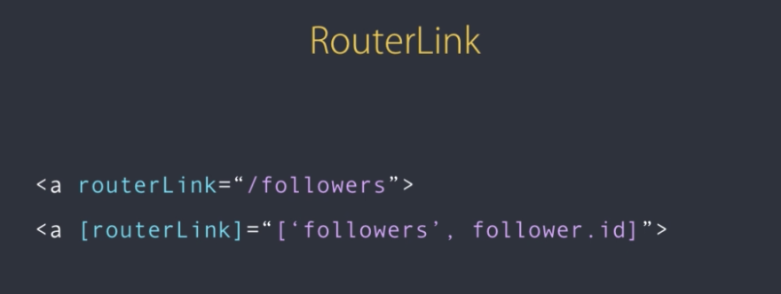

## Routing & Navigation
* In this section, I have created my examples in ```../exercises/exercise-routing-navigation/examples```. 
* There exists a module called ```Router```, in Angular.
    * Angular modules include:
        * ```Router```
        * ```Forms```
        * ```Reactive Forms```
        * ```Http```
* There are 3 steps to navigation in Angular:
    * Configure routes
        * A route is the mapping of a path to a component.
    * Add a router outlet
        * This is where is we display the corresponding component when a given route becomes active.
    * Add links
* Configuring Routes
    * We configure roots by adding ```RouterModule``` into ```src/app/app.module.ts``` and mapping paths to components.
        * example:
            ```typescript
                // app.module.ts
                ...
                imports: [
                    ...
                    RouterModule.forRoot([
                        { 
                            path: '', 
                            component: HomeComponent 
                        },
                        { 
                            path: 'followers', 
                            component: GithubFollowersComponent 
                        },
                        { 
                            path: 'profile/:username', 
                            component: GithubProfileComponent 
                        },
                        { 
                            path: 'posts', 
                            component: PostComponent 
                        },
                        { 
                            path: '**', 
                            component: NotFoundComponent 
                        }
                    ])
                ]
            ```
            * ```/:username``` is a parameter that will be dynamically replaced at runtime.
            * ```**``` is a wildcard, that catches any URL in the browser.
                * Note, order is important for the objects we supply to ```RouterModule.forRoot([])```.
                    * We must place the wildcard at the end or no other routes will be accessible.
                    * More specific routes need to be placed first; routes should be ordered from most-specific to least-specific.
* Router Outlet
    * We add a ```<router-outlet></router-outlet>``` directive to ```app.component.html```, so that we a route becomes active, the corresponding component is rendered after the ```<router-outlet>``` tag.
* RouterLink
    * We don't use the ```href``` attribute with Angular routing because every time we click on a link, the entire page is downloaded and the Angular app is re-initialised.
        * This causes the page to flicker unnecessarily, reducing the user experience.
    * When we click on a link, we only want the content on the new page to be downloaded -  to do this, we replace the ```href=""``` attribute with the ```routerLink=""``` directive.
    * example:
        ```html
            <!-- navbar.component.html -->
            <ul class="nav navbar-nav">
                <li><a class="active" routerLink="/">Home</a></li>
                <li><a routerLink="/followers">Followers</a></li>
                <li><a routerLink="/posts">Posts</a></li>
            </ul>
        ```
    * An application built this way is referred to as a 'Single Page Application' (SPA).
        * A single page is downloaded from the server and as the user navigates from one page to another, only the contents of the target page is downloaded.
    * We use the property binding syntax when supplying a parameter to a ```routerLink``` at runtime. We bind the ```routerLink``` directive to an expression; an array of the path, followed by the path parameters.
        * example:
            ```html
                <!-- github-followers.component.html -->
                <div 
                    *ngFor="let follower of followers" 
                    [routerLink]="['/profile', follower.login]"
                    class="media">
                    ...
                    <div class="media-body">
                        ...
                        <a 
                            [routerLink]="follower.html_url" 
                            target="_blank">
                            {{ follower.html_url }}
                        </a>
                    </div>
                </div>
            ```
    * Router Link Syntax     
        <br>
        
        
        <br>