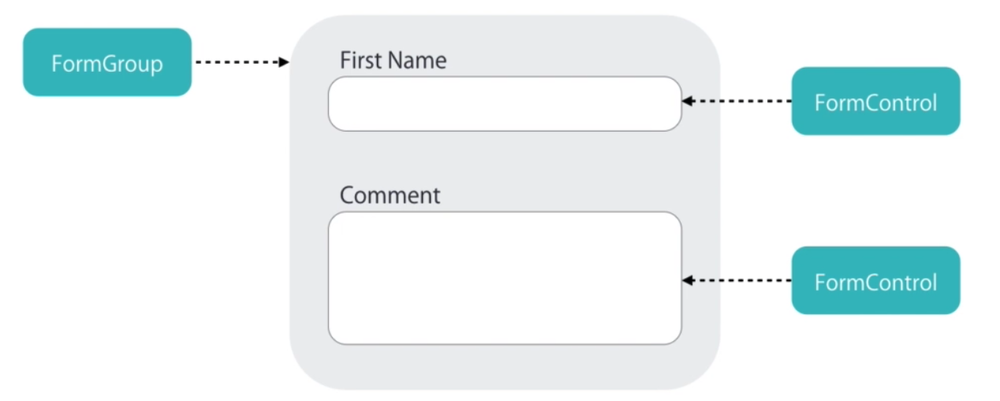
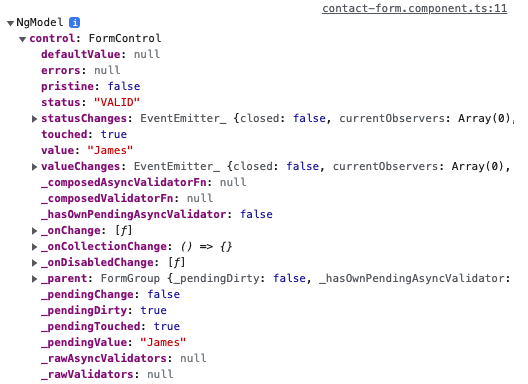
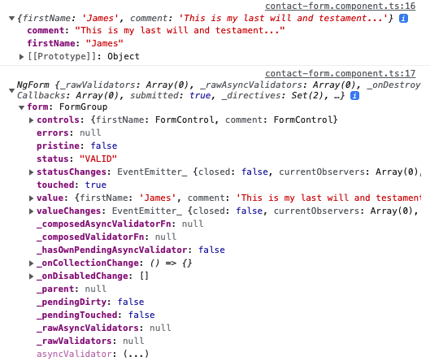
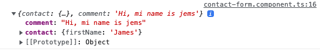
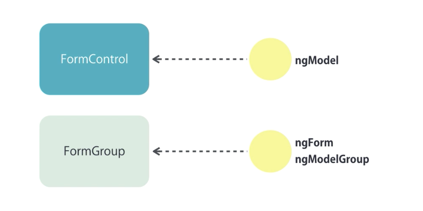

## Template-Driven Forms
* Building a Bootstrap Form
    * see example in ```../exercises/exercise-zippy-component/my-soln```
* Types of Forms
    * In Angular there is a class called ```FormControl``` that is used to manage input fields in our application.
        * Every input field requires an instance of the ```FormControl``` class and has the following properties:
            * value
            * touched / untouched - mouse click or not
            * dirty / pristine - value changed or not
            * valid
            * errors
        * We use a ```FormControl``` object to track the state changes and validity of the input field that the object is bound to.
    * Similarly, there is a class called ```FormGroup``` - which contains one or more ```FormControl```'s.
        * In a simple application, we probably would only need a single ```FormGroup```
        * In a larger one, we may have multiple distinct forms (such as Billing and Shipping), and so we would encapsulate each one in its own separate ```FormGroup```.
        * ```FormGroup``` has all of the same properties as ```FormControl``` - this makes it easier to gather together validation errors and values, as we don't have it iterate over each ```FormControl``` input field to get its status.    
        <br>
        
        
        <br>
    * There are two ways to create these form objects:
        * Template-driven: using directives
            * good for simple forms
            * simple validation
            * easier to create
            * less code
        * Reactive: using explicit code
            * more control over validation logic
            * good for complex forms
            * unit testable
* Building Template Driven Forms
    * When we apply the ```ngModel``` directive to an input field, an associated ```FormControl``` object is created under the hood.
        * example: 
            * ```<input ngModel name="firstName" id="firstName" type="text" class="form-control">```
                * ```ngModel name="<NAME>"``` is required to create the ```FormControl``` object. 
                * remember to import ```FormsModule``` into ```app.module.ts```
        * extended example:
            ```javascript
                // contact-form.component.html
                <form>
                    <div class="form-group">
                        <label for="firstName">First Name</label>
                        <input ngModel name="firstName" #firstName="ngModel" (change)="log(firstName)" id="firstName" type="text" class="form-control">
                    </div>
                    ...
                </form>

                // contact-form.component.ts
                log(obj: Object){
                    console.log(obj);
                }
            ``` 
            * This is the ```ngModel``` object result in the console - it contains the ```FormControl``` object for this input field and can be used to track the state changes and validity.
                <br>
                <br>
                
                <br>
                <br>
* Validation
    * One piece of validation that we can implement is to make a field be ```required``` - we do this using the inbuilt HTML5 ```required``` attribute on the desired input form. Then we can use ```ngIf``` to render an error message if ```templateVarForNgModel.touched && !templateVarForNgModel.valid```
        * example:
            ```javascript
            // app.component.html
            <form>
                <div class="form-group">
                    <label for="firstName">First Name</label>
                    <input 
                        required 
                        ngModel 
                        name="firstName" 
                        #firstName="ngModel" 
                        (change)="log(firstName)" 
                        id="firstName" 
                        type="text" 
                        class="form-control"
                    >
                    <div class="alert alert-danger" *ngIf="firstName.touched && !firstName.valid">First name is required</div>
                </div>
                ...
            </form>
            ```
    * In Angular, there are a few validators that build upon the HTML5 validation attributes (as we have seen with ```required```).
        * example:
            ```html
                <input 
                    required
                    minlength="3"
                    maxlength="10" 
                    pattern="^[a-zA-Z]*$"
                    ...>
                <div 
                    class="alert alert-danger" 
                    *ngIf="firstName.touched && !firstName.valid">
                    <div *ngIf="firstName.errors?.['required']">
                        First name is required.
                    </div>
                    <div *ngIf="firstName.errors?.['minlength']">
                        First name must be at least {{ firstName.errors?.['minlength'].requiredLength }} characters.
                    </div>
                    <!-- Input prevents any more characters than <maxlength> for us -->
                    <div *ngIf="firstName.errors?.['pattern']">
                        First Name must be alphabetical.
                    </div>
                </div>
            ```
            * See [this](https://stackoverflow.com/questions/70106472/property-fname-comes-from-an-index-signature-so-it-must-be-accessed-with-fn) Stack Overflow question about ```.minlength``` vs ```.['minlength']```
            * See [this](https://stackoverflow.com/questions/336210/regular-expression-for-alphanumeric-and-underscores) for more info on Regex
    * Styling Invalid Input Fields
        * There are ```ng-``` class names applied to an input field when we bind it to a ```FormControl``` - these include ```ng-touched```, ```ng-invalid```, etc. We can use these class names to apply CSS to input field when the state changes.
            * example: when the input field is touched and invalid, it will receive ```class="ng-invalid ng-dirty ng-touched"```
                * We can then apply the following CSS:
                    ```css
                        /* src/styles.css */
                        .form-control.ng-touched.ng-invalid { border: 1px solid crimson; }
                    ```
                    * note, we should always give input fields the className ```.form-control```
* Cleaner Templates
    * Code should be written to be read easily by yourself and by fellow developers; there is a way to structure your templates to improve readability. As a general rule, you should have to scroll horizontally to read long lines of code - better to separate long lines into multiple shorter lines.
    * example:
        ```html
            <input 
                required // all validation attr
                ngModel 
                name="firstName" 
                #firstName="ngModel" // template var
                id="firstName" 
                type="text" 
                class="form-control">
            <!-- note this is the preferred order of attr's in an input field -->
        ```
* ngForm
    * As a reminder: ```ngModel```, when applied to an input field, creates a ```FormControl``` object under the hood and binds it to that input field.
        * The other use for ```ngModel``` is for two-way binding: ```[( )]```
    * ```ngForm``` is automatically applied to ```<form>``` elements to create a ```FormGroup``` object under the hood.
    * ```ngForm``` has an output property called ```ngSubmit``` which is used to raise a custom event when the form is submit - with this, we can retrieve the input field values from the ```FormGroup``` object in our component.
    * example:
        ```javascript
            // contact-form.component.html
            <form #form="ngForm" (ngSubmit)="submit(form)">
                <div class="form-group">
                    <label for="firstName">First Name</label>
                    <input 
                        required
                        minlength="3"
                        maxlength="10" 
                        pattern="^[a-zA-Z]*$"
                        ngModel 
                        name="firstName" 
                        #firstName="ngModel" 
                        (change)="log(firstName)" 
                        id="firstName" 
                        type="text" 
                        class="form-control">
                    <div 
                        class="alert alert-danger" 
                        *ngIf="firstName.touched && !firstName.valid">
                        <div *ngIf="firstName.errors?.['required']">
                            First name is required.
                        </div>
                        <div *ngIf="firstName.errors?.['minlength']">
                            First name must be at least {{ firstName.errors?.['minlength'].requiredLength }} characters.
                        </div>
                        <!-- Input prevents any more characters than <maxlength> for us -->
                        <div *ngIf="firstName.errors?.['pattern']">
                            First Name must be alphabetical.
                        </div>
                    </div>
                </div>
                <div class="form-group">
                    <label for="comment">Comment</label>
                    <textarea 
                        ngModel 
                        name="comment" 
                        id="comment" 
                        cols="30" rows="10" 
                        class="form-control">
                    </textarea>
                </div>
                <button 
                    [disabled]="!form.valid"
                    class="btn btn-primary" 
                    type="submit">
                    Submit
                </button>
            </form>

            // contact-form.component.ts
            submit(form: NgForm) {
                console.log(form.value);
                console.log(form);
            }
        ``` 
        * This is the ```ngForm``` object result in the console - it contains the ```FormGroup``` object for this ```<form>``` and can be use to retrieve the input values for the whole form.
            <br>
            <br>
            
            <br>
            <br>
* ngModelGroup
    * Sometimes we want to build complex forms that contain multiple groups. Perhaps our form needs to build a response to a backend API, which is a complex object. We can represent this complex object using ```ngModelGroup```.
        * ```ngModelGroup``` allows our forms to build complex nested objects as their response.
    * example:
        ```html
            <form #form="ngForm" (ngSubmit)="submit(form)">
                <div 
                    ngModelGroup="contact"
                    #contact="ngModelGroup"
                    >
                    <div *ngIf="contact.touched && !contact.valid">
                        ...contact group validation errors...
                    </div>
                    <div class="form-group">
                        <label for="firstName">First Name</label>
                        <input 
                            ... 
                            id="firstName" 
                            type="text" 
                            class="form-control">
                        <div 
                            class="alert alert-danger" 
                            *ngIf="firstName.touched && !firstName.valid">
                            ...first name validation errors...
                        </div>
                    </div>
                </div>
                ...
            </form>
        ```
        * We can see in the console below, that ```contact``` is now a complex object due to the use of ```ngModelGroup```; we could have additional properties of ```contact``` by adding extra ```.form-control div>input```'s inside this ```ngModelGroup <div>``` 
            <br>
            <br>
            
            <br>
            <br>
* Control Classes and Directives
    * To recap:
        * In Angular, we have two classes to keep track of input fields and their validity.
            * ```FormControl```: represents a single ```<input>``` field
                * The ```ngModel``` directive (plus a ```name``` attribute) must be applied to an ```<input>``` field to create an associated ```FormControl``` instance/object under the hood. 
                * Representing ```ngModel``` as a template variable, we can track the state change of this single ```<input>``` and check its validity.
            * ```FormGroup```: represents a group of ```<input>``` fields
                * It represents an entire form or, optionally, groups within a form. Automatically, the ```ngForm``` directive is applied by Angular to the ```<form>``` - this internally creates a ```FormGroup``` object and associates it with the HTML ```<form>```.
                * Representing ```ngForm``` as a template variable, we can track the state change of this entire group of ```<input>```'s and check their overall validity.
                * ```ngModelGroup``` is used to represent a sub-group within our form - where the ```<input>``` fields each represent a property of a complex object (the ```ngModelGroup``` represent this complex object).
                    * Representing ```ngModel``` as a template variable, we can track the state change of this group/model/object and track its validity independently of the overall form.
                    * Using ```ngModelGroup``` applies a new ```FormGroup``` object to the set of ```<input>``` fields. In this way, it is very similiar to ```ngForm``` - the difference being that ```ngForm``` has an ```@Output``` output property (```ngSubmit```) and ```ngModelGroup``` does not - this makes sense, as you cannot submit part of a form.
        
        <br>
        
        <br>
        <br>
* Disabling the Submit Button
    * Using the template variable that represents ```ngForm```, we can disable our button when the form is not in a valid state.
    * example:
        ```html
            <button 
                [disabled]="!form.valid"
                class="btn btn-primary" 
                type="submit">
                Submit
            </button>
        ```
* Check Boxes
    * example:        
        ```html
            <div class="form-group checkbox">
                <label>
                    <input 
                        ngModel 
                        name="isSubscribed" 
                        type="checkbox"> 
                        Subscribe to mailing list
                </label>
            </div>
            <p> {{ form.value | json }} </p>
        ```
        * using ```<p> {{ form.value | json }} </p>``` is a great trick to view your form contents, whilst you are building your form.
        * also note, as a rule, forms in HTML follow this convention:
            * ```<div class="form-group"> <input class="form-control"> </div>```
* Drop Down List
    * example:
        ```html
        <!-- contact-form.component.ts -->
          contactMethods = [
            { id: 1, name: 'Email'},
            { id: 2, name: 'Phone'},
            { id: 3, name: 'SMS'},
            { id: 4, name: 'Post'}
        ]

        <!-- contact-form.component.html -->
        <div class="form-group">
            <label for="contactMethod">Contact Method</label>
            <select 
                ngModel
                name="contactMethod" 
                id="contactMethod" 
                class="form-control">
                <option value=""></option> <!-- empty option improves usability -->
                <option 
                    *ngFor="let method of contactMethods"
                    [value]="method.id">
                    {{ method.name }}
                </option>
            </select>
        </div>
        ```
    * Note: 
        * In some cases, you may want to bind the value of an input field to a complex object - to do this, you need to use the ```[ngValue]``` directive. This is becuase the ```value``` HTML attribute can only take in a string.
            * This is not best practise and should only be used when you specifically need to store a complex object in ```value```.
        * You can apply the ```multiple``` HTML attribute to a ```<select>``` field, if you want to be able to select more than one ```<option>``` - look a bit dodgey though...
            * This returns you an array of selected options
* Radio Buttons
    * Radio buttons, by their very nature, can only have one selected option.
    * example:
        ```html
        <!-- contact-form.component.ts -->
          contactMethods = [
            { id: 1, name: 'Email'},
            { id: 2, name: 'Phone'},
            { id: 3, name: 'SMS'},
            { id: 4, name: 'Post'}
        ]

        <!-- contact-form.component.html -->
        <div *ngFor="let method of contactMethods" class="radio">
            <label for="">
                <input 
                    ngModel
                    name="contactMethod"
                    type="radio" 
                    [value]="method.id">
                    {{ method.name }}
            </label>
        </div>
        <p> {{ form.value | json }} </p>
        ```
* Course Form Exercise
    * see ```../exercises/exercise-course-form/my-soln``` for my initial solution
    * see ~~```../exercises/exercise-course-form/mosh-soln```~~ for Mosh's better solution
        * our solutions were too similar to warrant creating a separate project
        * notes:
            * The only difference between our solutions was on variable naming. I chose to use ```courseName``` but Mosh went with ```name``` to represent the 'Course Name' field - this makes more sense because we want the ```course``` JSON strutcture to use ```name``` not ```courseName```.
            * I also forgot to add validation to the 'Category' input field but it would follow the same principles that I used for the 'Course Name' one.
