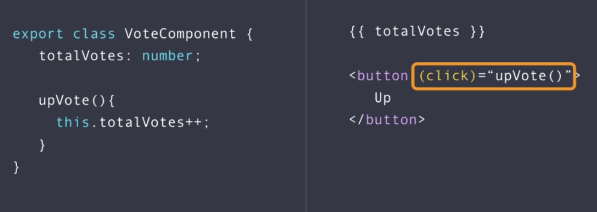

## Unit Testing
* Automated Testing is where write additional code to test aspects of our application. We do this to reduce the amount of manual testing and to test aspects of the app that manual testing could not reach.
    * Automated Testing speeds up the testing process, allows us to increase the depth and coverage of our tests and ultimately, delivers higher quality software. 
        * It is worth the time investment.
* In general, there are three types of automated tests
    * Unit
        * Unit Testing is where we test the smallest encapsulated units of our application, in isolation. 
            * This is without databases, API calls, etc
            * Typically, this means testing the output of individual methods, for given inputs.
    * Integration
        * Integration Testing is where we test mutliple units of our application, working together.
    * End-to-end (E2e)
        * E2e Testing is where we test a path through the whole application.
* Example
    * In Angular, we might want to test a VoteComponent (see image below).
        * The VoteComponent is a TypeScript class, with a template attached. 
        * In Unit Testing, we can test the individual methods of this TS class (```upVote()```) and check that the properties (```totalVotes```) have been updated accordingly. We do this disregarding the template; if the ```upVote()``` method was not bound to the ```(click)``` event in the template, we could not tell by Unit Testing.
        * We use Integration Testing for this: we test that the button, when clicked, triggers the method in the TS class and that the correct behaviour occurs. This involves starting up the test in an Angular environment, associating the TypeScript class with it's template.
        * Put simply:
            * Unit Test: TypeScript class only
            * Integration Test: TypeScript class + template only 

        <br>

        

        <br>

* Examples
    * My examples for this section can be found in ```../exercises/exercise-unit-testing/examples```.
* Unit Testing Fundamentals
    * Tests are first class citizens and so should we should create them with best practise in mind. This includes:
        * Single responsibility
        * ~10 lines of code or less (small, neat)
        * Proper naming (self-explanatory)
    * Karma is the test runner in Angular
        * We can start our tests with ```ng test```
        * ```*.spec.ts``` is the naming convention for  testing files. Karma is looking to start tests in files that follow this convention.
        * Karma offers us Hot Module Reloading (or at least an equivalent of it) - when developing Angular applications, we can take advantage of this by having one terminal/browser window open with Karma running our tests; everytime we save a file, our tests will be re-run and we will quickly see if anything breaks.
    * Jasmine is the framework that our unit tests are written in. It comes with many functions but the two that we use most frequently are:
        * ```describe()``` - defines a 'suite', a group of related tests
        * ```it()``` - defines a 'spec', an individual test
    * example:
        ```typescript
            // compute.ts
            export function compute(number: number) {
                if (number < 0)
                    return 0; 

                return number + 1;
            }

            // compute.spec.ts
            import { compute } from "./compute";

            describe('compute', () => {
                it('should return 0 if input is negative', () => {
                    const result = compute(-1);
                    expect(result).toBe(0);
                })
            })
        ```
* Working with Strings and Arrays
    * If we want to test the outputs of methods that are strings and arrays, the tests are very fragile if we test for the exact string/array that is outputted. We can increase the stability by looking to see if the string/array contains the element that we want - using ```.toContain()```.
    * example:
        ```typescript
            // greet.ts
            export function greet(name: string) { 
                return 'Welcome ' + name; 
            }

            // greet.spec.ts
            import { greet } from "./greet";

            describe('greet', () => {
                it('should include the name in the message', () => {
                    expect(greet('James')).toContain('James');
                })
            })
        ```
* Set Up & Tear Down
    * Using ```beforeEach()``` we can initialise (Arrange) our component before running each test, with only a single block of code. This means that we don't have to do this in each test - leading to cleaner code.
        * There is also a ```afterEach()``` function, where we can tear down and clean up our component if required.
        * Furthermore, we have ```beforeAll()``` and ```afterAll()```, which is only executed once, before/after all the tests.
    * example:
        ```typescript
            // vote.component.ts
            export class VoteComponent { 
                totalVotes = 0; 

                upVote() { 
                    this.totalVotes++;
                }

                downVote() { 
                    this.totalVotes--;
                }
            }

            // vote.component.spec.ts
            describe('VoteComponent', () => {
                let component: VoteComponent;

                beforeEach(() => {
                    // Arrange - initialise the system under test
                    component = new VoteComponent();
                })

                it('should increment totalVotes when up-voted', () => {
                    // Act - call the actual method/function
                    component.upVote();

                    // Assert - check the result equals what is expected
                    expect(component.totalVotes).toBe(1);
                });

                it('should decrement totalVotes when down-voted', () => {
                    // Act - call the actual method/function
                    component.downVote();

                    // Assert - check the result equals what is expected
                    expect(component.totalVotes).toBe(-1);
                });
            });
        ```
* Working with Forms
    * When it comes to testing Model-driven/Reactive Forms in Angular, we would typically want to test two things:
        * The presence of the desired Form Controls
        * The use of the desired validation on a certain Form Control
     * example:
        ```typescript
            // todo-form.component.ts
            export class TodoFormComponent { 
                form: FormGroup; 

                constructor(fb: FormBuilder) {
                    this.form = fb.group({
                    name: ['', Validators.required],
                    email: [''],
                    });
                }
            }

            // todo-form.component.spec.ts
            describe('TodoFormComponent', () => {
                var component: TodoFormComponent; 

                beforeEach(() => {
                    component = new TodoFormComponent(new FormBuilder);
                });

                it('should create a form with 2 controls', () => {
                    expect(component.form.contains('name')).toBeTruthy();
                    expect(component.form.contains('email')).toBeTruthy();
                });

                it('should make the name control required', () => {
                    let control = component.form.get('name');

                    control?.setValue('');
                    
                    expect(control?.valid).toBeFalsy();
                });
            });
        ```    
* Working with Event Emitters
    * We can test when an event is raised by a component method by calling the method under test and then subscribing to the Event Emitter for that event.
    * example:
        ```typescript
            // vote.component.ts
            export class VoteComponent { 
                totalVotes = 0; 
                voteChanged = new EventEmitter();

                upVote() { 
                    this.totalVotes++;
                    this.voteChanged.emit(this.totalVotes);
                }
            }

            // vote.component.spec.ts
            import { VoteComponent } from './vote.component'; 

            describe('VoteComponent', () => {
                var component: VoteComponent; 

                beforeEach(() => {
                    component = new VoteComponent();
                });

                it('it should raise voteChanged event when up-voted', () => {
                    let totalVotes: any = null;
                    component.voteChanged.subscribe(tv => totalVotes = tv);

                    component.upVote();

                    // expect(totalVotes).not.toBeNull();
                    expect(totalVotes).toBe(1);
                });
            });
        ```
    * Note: we chain our ```toBe...()```, ```toContain()```, etc functions to ```.not```, if we wish to negate the expected result.
        * ```expect(actual_result).not.toBeNull(expected_result);```
            * Stack Overflow [post](https://stackoverflow.com/questions/44542743/what-is-the-alternative-for-tonotequal-in-jasmine)
* Working with Spies
    * We would typically use Spies when our component relies on a service that makes calls to the backend.
    * We use the ```spyOn(object, 'methodName')``` method to put a spy on a method in a class.
        * This allows us to check if a particular method has been called and change the implementation of that method, change the return value, throw and error, etc.
        * A Spy gives us control over a method in a class.
    * Fantastic Stack Overflow [post](https://stackoverflow.com/questions/44074764/mock-vs-spy-in-angular#:~:text=Spies%20are%20stubs%20that%20also,they%20are%20expected%20to%20receive.) about Mocks vs Spies in Angular
        * TLDR:
            * Dummy objects 
                * are passed around but never actually used. Usually they are just used to fill parameter lists.
            * Stubs 
                * provide canned answers to calls made during the test
            * Spies 
                * are stubs that also record some information based on how they were called
            * Mocks 
                * objects pre-programmed with expectations which form a specification of the calls they are expected to receive.
    * example:
        ```typescript
            // todos.component.ts
            ...
            ngOnInit() { 
                this.service.getTodos().subscribe((t: any) => this.todos = t);
            }

            // todos.component.spec.ts
            describe('TodosComponent', () => {
                let component: TodosComponent;
                let service: TodoService;

                beforeEach(() => {
                    const spy = jasmine.createSpyObj('HttpClient', { post: of({}), get: of({}) })
                    service = new TodoService(spy);

                    component = new TodosComponent(service);
                });

                it('should set todos property with items returned from the server', () => {
                    let todos = [1,2,3,4];

                    // Arrange
                    spyOn(service, 'getTodos').and.callFake(() => {
                    return of(todos)
                    })

                    // Act
                    component.ngOnInit();

                    // Assert
                    expect(component.todos).toBe(todos);
                });
            });
        ```
    * Note:
        * Great Stack Overflow [post](https://stackoverflow.com/questions/66941972/argument-of-type-null-is-not-assignable-to-parameter-of-type-httpclient-on-a) on mocking a ```HttpClient``` dependency for unit testing.
* Interaction Testing
    * 


<br>
<br>
    * example:
        ```typescript
            //
        ```


