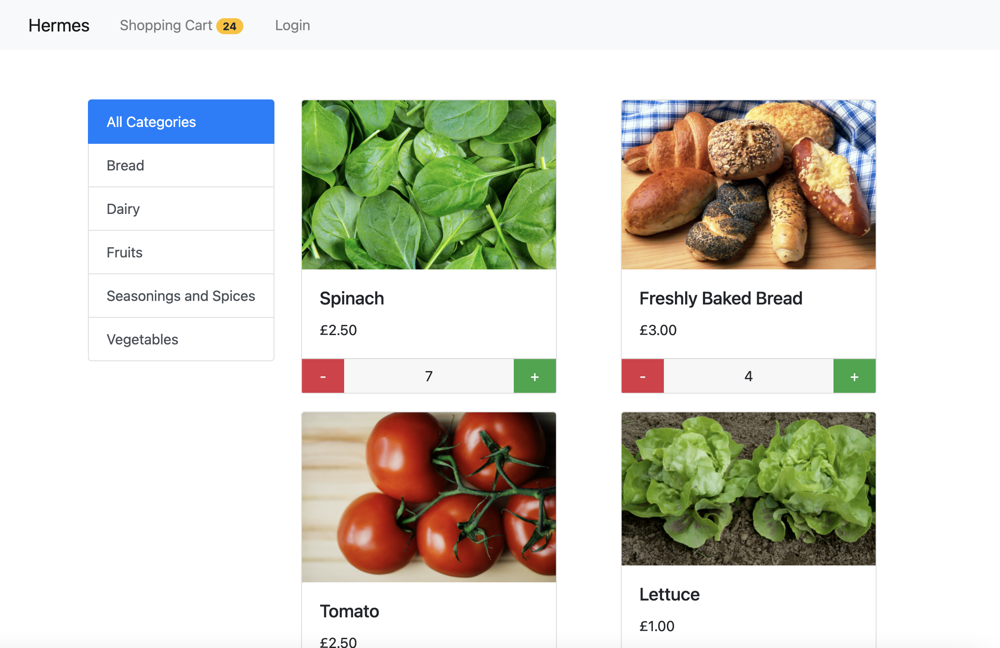

# Hermes
*E-Commerce Final Project* 

<br>


> Hermes is the Greek God of Commerce

<br>
<br>



> Hermes Products Screen

<br>

## Overview
* This e-commerce site (Hermes) is my attempt at ```The Complete Angular Course``` final project.
* Useful Links:
    * [Technical References](./technicalreferences.md)
    * [Udemy Videos](https://www.udemy.com/course/the-complete-angular-master-class/learn/lecture/7750398#notes)
    * [Mosh's Repo](https://github.com/mosh-hamedani/organic-shop)
* Note:
    * Due to time constraints, I got this project working but did not spend the time to refactor it (make it beautiful).
* Test coverage:
    * ```0%```

<br>

## User Guide
* Run the application locally (localhost:4200)
    * ```ng serve```
* Test the application locally
    * ```ng test --code-coverage```
* Access the application on Firebase
    * https://hermes-c4663.web.app


